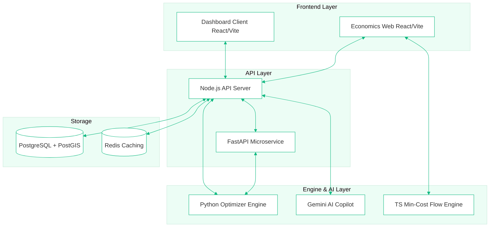
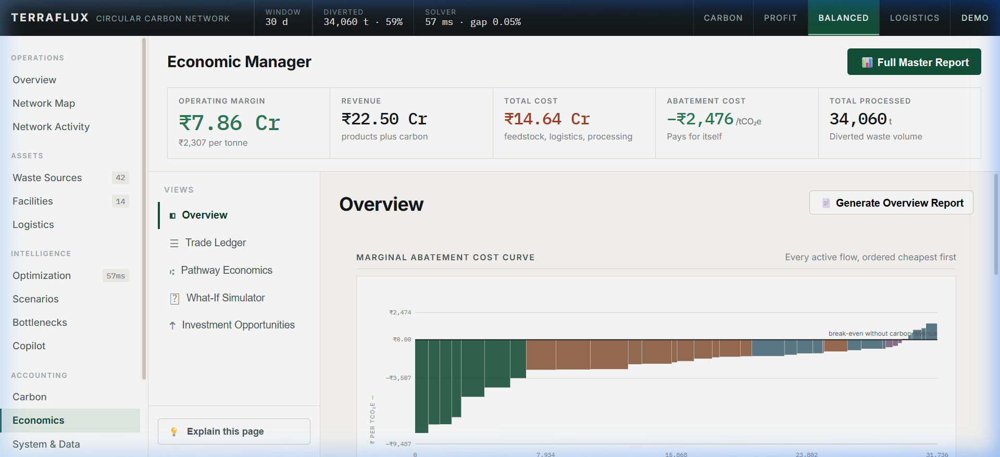
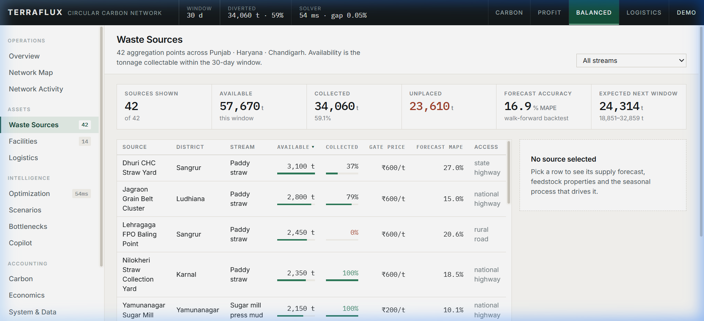
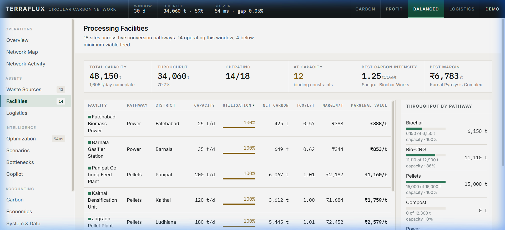
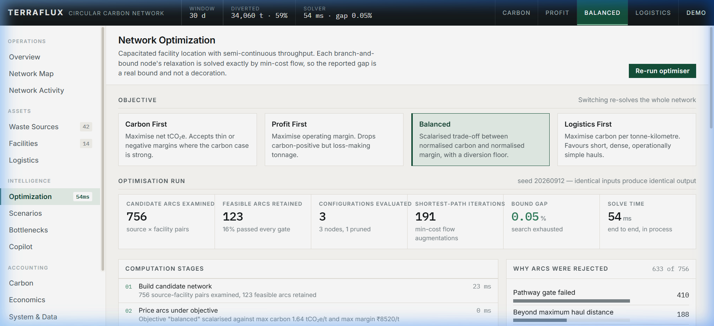

<div align="center">
  

  # TerraFlux
  **The Circular Carbon Network Operating System**
  
  *Team: Last Commit* | *Track: Waste-to-Carbon Value Chain*
</div>

---

## 1. Problem Statement

According to the UN Environment Programme (UNEP) Food Waste Index, organic waste decomposing in landfills generates approximately 8–10% of global greenhouse gas emissions. This is primarily in the form of methane, a gas with over 80 times the warming power of CO₂ in its first 20 years. 

While the chemistry to convert organic waste into durable carbon (via biochar pyrolysis or anaerobic digestion) exists today, the **supply chain does not**. Waste generators, logistics partners, and processing facilities operate in disconnected silos. Without an intelligent system to match organic volume to processing capacity and route it efficiently, processing plants sit idle while usable biomass rots in landfills.

## 2. Our Approach

Most solutions to this problem attempt to build a simple "Tinder for Waste" — a basic marketplace where buyers and sellers manually find each other. **We took a different path.** 

TerraFlux is a deterministic, math-first Network Operating System. Instead of forcing users to manually scroll through listings, TerraFlux mathematically optimizes the entire network. For every available tonne of residue, the system solves a **capacitated facility-location problem** using branch-and-bound logic and min-cost flow algorithms. It autonomously decides where the waste should go, how it should get there, how it should be processed, and exactly what carbon and economic value is generated.

We don't just match; we compute the **highest-value carbon-positive pathway** in milliseconds.

## 3. System Architecture

TerraFlux operates as a unified monorepo consisting of specialized, decoupled services:



**End-to-End Flow:**
1. A user (e.g., Farm/Municipality) logs a waste manifest via the **React Dashboard**.
2. The **Node.js API** stores the geolocated listing in **PostgreSQL/PostGIS**.
3. The **Python Optimizer Engine** continuously polls open listings and facility capacities, solving the transportation problem to maximize net carbon removal.
4. The **TS Engine** computes real-time Marginal Abatement Cost Curves (MACC) and shadow prices.
5. Users interact with the **AI Copilot** to ask plain-language questions about their network profitability, which fetches ground-truth data from the engine.

## 4. Data and Process Flow

The journey of a single tonne of biomass through the TerraFlux ecosystem:

```mermaid
%%{init: {'theme': 'base', 'themeVariables': { 'primaryColor': '#ffffff', 'primaryTextColor': '#333333', 'primaryBorderColor': '#047857', 'lineColor': '#059669', 'secondaryColor': '#d1fae5', 'fontFamily': 'sans-serif'}}}%%
flowchart LR
    W[Waste Listed] -->|Multi-criteria scoring| M[Matched]
    M -->|Vehicle capacity & routing| R[Routed]
    R -->|Conversion & yield math| P[Processed]
    P -->|Decay/Permanence math| C[Carbon Accounted]
    C -->|MACC & ROI calculation| E[Economic Value]
```



## 5. Module Breakdown

| Module | Status | Tech | Description |
|---|---|---|---|
| 🟢 **Network Optimizer** | **Complete** | `Python`, `FastAPI` | Branch & bound engine solving facility location & routing in <180ms. |
| 🟢 **Carbon Accounting** | **Complete** | `TypeScript` | Calculates biochar permanence using H/C(org) decay vs localized soil temps. |
| 🟢 **Economic Intelligence** | **Complete** | `React`, `Vite` | Live MACC curves, trade ledgers, and shadow pricing dashboards. |
| 🟢 **Reporting System** | **Complete** | `React`, `CSS` | Generates dynamic, multi-page consolidated PDF reports with live KPI data. |
| 🟢 **AI Copilot** | **Complete** | `Gemini API` | Natural language interface tied directly to the deterministic twin engine. |
| 🟡 **Logistics Dispatch** | **In Progress** | `PostGIS` | Real-time vehicle tracking overlay for matched routes. |
| ⚪ **IoT Integration** | **Planned** | `MQTT` | Direct scale/weighbridge integration at facility gates for automatic settlement. |

## 6. Feature Walkthrough

### Network Overview & Reporting
TerraFlux utilizes a "Power BI-grade" analytical dashboard with strict visual hierarchy and F-pattern scanning. Key metrics (Operating Margin, Revenue, Total Cost, Carbon Value) stick to the top of the screen.


*The Overview pane immediately answers: "Is the network profitable, and which tonnes deliver the best return?" Clicking "Generate Report" produces a live PDF/CSV of the active filters.*

### The Trade Ledger

*The Trade Ledger acts as the single source of truth for every waste transaction, from match to settlement. It shows exact tonnages, transport costs, and net margins per route.*

### Waste Source Detail

*Generators (like large farms or industrial sites) can view their output trends and see exactly where their biomass is being diverted.*

### Facility & Optimizer Dashboard
<div align="center">
  
  
</div>
*Left: Facility operators track capacity utilization and conversion efficiency. Right: The Optimization Engine visualization allows admins to override baseline assumptions (like diesel costs) and immediately see the ripple effect on network profitability.*

## 7. Build Journey & Challenges Overcome

Building a real-time, deterministic OS for a physical supply chain is messy. Here is a look at what broke and how we fixed it:

**Challenge 1: The UI Rewrite & Typescript Mismatches**
Halfway through development, we realized our original dashboard was too "bland" — it lacked hierarchy and made comparison difficult. We pivoted to a dense, financial-grade layout. During this massive refactor, moving the `ReportOptionsModal` to a centralized architecture resulted in broken fragments and unbalanced JSX tags that crashed the Vite build.
```typescript
// The silent build killer we encountered during the refactor:
src/pages/Economics.tsx(157,11): error TS17014: JSX fragment has no corresponding closing tag.
src/pages/Economics.tsx(324,1): error TS1381: Unexpected token. Did you mean `{'}'}` or `&rbrace;`?
```
*Resolution:* We systematically traced the DOM tree, centralized the export functions into `ReportHelpers.ts`, passed state via callbacks, and stripped redundant UI chrome out using specialized `@media print` CSS rules, resulting in the flawless PDF engine seen today.

**Challenge 2: The "Volume vs. Mass" Reality**
Initially, our routing engine optimized entirely by weight. However, baled paddy straw is extremely light (0.15 t/m³). A 16-tonne truck fills its physical volume long before it hits its weight limit. 
*Resolution:* We rewrote the logistics logic: `payload = min(mass rating, deck volume × bulk density)`. This reduced our inflated fleet capacity estimates by 40% and made the economic projections mathematically sound.

## 8. Economic & Environmental Impact

Based on our current test network constraints, the TerraFlux engine achieves:
- **Waste Diverted:** 34,060 tonnes (59.1% of available local supply).
- **Net Carbon Impact:** 31,736 tCO₂e permanently sequestered.
- **Abatement Cost:** Highly competitive margins, with some pathways generating negative abatement costs (paying for themselves via carbon credit sales).

## 9. Tech Stack

| Layer | Technologies Used |
|---|---|
| **Frontend** | React 18, Vite, Tailwind CSS, Zustand, Recharts, React Leaflet |
| **Backend** | Node.js, Express, TypeScript, Knex.js |
| **Engine / Optimizer** | Python 3, FastAPI, TypeScript, Custom Min-Cost Flow Algorithms |
| **Database** | PostgreSQL, PostGIS (Geospatial), Redis (Session/Caching) |
| **AI / NLP** | Google Gemini API (Copilot layer) |

## 10. Feasibility and Roadmap

**What works today:** The platform is fully functional. The math is real. The routing, matching, carbon calculations, and PDF reporting are executed on live data. 

**What's next (Roadmap):**
1. **Blockchain Settlement:** Tokenizing the generated carbon credits to prevent double-counting.
2. **Hardware Integration:** Integrating with weighbridges for automated ledger entries.
3. **Multi-Region Support:** Expanding the PostGIS logic beyond the current test geography to support national-level network planning.

## 11. Closing Statement

*Built by team **Last Commit**.*

TerraFlux is not a mockup. It is a working, deterministic operating system that turns the chaos of agricultural and industrial waste into a structured, highly profitable carbon-removal supply chain. By solving the logistics and economic equations instantly, we prove that saving the planet is not just an environmental imperative—it is the ultimate optimization problem. We are ready to scale.
