<div align="center">

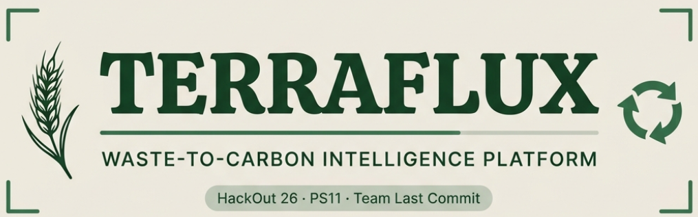

<p>
  
  
  
</p>
<p>
  
  
  
  
</p>
<p>
  
  
  
  
</p>

<br/>

> **"Waste is not the end of a journey. It is the beginning of a carbon value chain."**

</div>

---

## 📋 Table of Contents

| # | Section |
|---|---------|
| 01 | [The Problem](#01--the-problem) |
| 02 | [The Core Insight](#02--the-core-insight) |
| 03 | [Platform Overview](#03--platform-overview) |
| 04 | [Gallery — Key Screens](#04--gallery--key-screens) |
| 05 | [Quick Start](#05--quick-start) |
| 06 | [Monorepo Structure](#06--monorepo-structure) |
| 07 | [Engine Architecture](#07--engine-architecture) |
| 08 | [Carbon Accounting](#08--carbon-accounting) |
| 09 | [Feedstock Modelling](#09--feedstock-modelling) |
| 10 | [Optimiser](#10--optimiser) |
| 11 | [Logistics Engine](#11--logistics-engine) |
| 12 | [Forecasting](#12--forecasting) |
| 13 | [Frontend — 27 Screens](#13--frontend--27-screens) |
| 14 | [Key Numbers](#14--key-numbers) |
| 15 | [Performance Benchmarks](#15--performance-benchmarks) |
| 16 | [Notable Model Findings](#16--notable-model-findings) |
| 17 | [Design Decisions and Rejections](#17--design-decisions-and-rejections) |
| 18 | [Scientific References](#18--scientific-references) |
| 19 | [Production Roadmap](#19--production-roadmap) |

---

## 01 — The Problem

<div align="center">
<svg width="820" height="110" viewBox="0 0 820 110" xmlns="http://www.w3.org/2000/svg">
  <rect width="820" height="110" rx="8" fill="#f5f1eb"/>
  <text x="410" y="18" text-anchor="middle" font-family="monospace" font-size="10" fill="#c05c1e" letter-spacing="2" font-weight="bold">CURRENT FRAGMENTED WORKFLOW — THE BROKEN STATE</text>
  <rect x="10" y="28" width="145" height="70" rx="6" fill="#fdf0ee" stroke="#ef4444" stroke-width="1" stroke-opacity="0.6"/>
  <text x="82" y="52" text-anchor="middle" font-family="monospace" font-size="9" fill="#fca5a5">FARMER/INDUSTRY</text>
  <text x="82" y="67" text-anchor="middle" font-family="monospace" font-size="8" fill="#c05c1e" fill-opacity="0.7">20 Mt paddy straw</text>
  <text x="82" y="81" text-anchor="middle" font-family="monospace" font-size="8" fill="#c05c1e" fill-opacity="0.5">burned/yr Punjab</text>
  <path d="M155,63 L185,63" stroke="#ef4444" stroke-width="2"/>
  <text x="170" y="56" text-anchor="middle" font-family="monospace" font-size="7" fill="#f97316">volume-blind</text>
  <rect x="185" y="28" width="155" height="70" rx="6" fill="#fdf5ee" stroke="#f97316" stroke-width="1" stroke-opacity="0.6"/>
  <text x="262" y="52" text-anchor="middle" font-family="monospace" font-size="9" fill="#fdba74">PROXIMITY MATCHING</text>
  <text x="262" y="67" text-anchor="middle" font-family="monospace" font-size="8" fill="#f97316" fill-opacity="0.7">"Tinder for Waste"</text>
  <text x="262" y="81" text-anchor="middle" font-family="monospace" font-size="8" fill="#f97316" fill-opacity="0.5">Ignores chemistry</text>
  <path d="M340,63 L370,63" stroke="#f97316" stroke-width="2"/>
  <text x="355" y="56" text-anchor="middle" font-family="monospace" font-size="7" fill="#f97316">40% cap</text>
  <rect x="370" y="28" width="155" height="70" rx="6" fill="#fdfbee" stroke="#eab308" stroke-width="1" stroke-opacity="0.6"/>
  <text x="447" y="52" text-anchor="middle" font-family="monospace" font-size="9" fill="#fde047">UNDERUTILIZED PLANT</text>
  <text x="447" y="67" text-anchor="middle" font-family="monospace" font-size="8" fill="#eab308" fill-opacity="0.7">~40% capacity only</text>
  <text x="447" y="81" text-anchor="middle" font-family="monospace" font-size="8" fill="#eab308" fill-opacity="0.5">Wrong feedstock</text>
  <path d="M525,63 L555,63" stroke="#ef4444" stroke-width="2"/>
  <rect x="555" y="28" width="255" height="70" rx="6" fill="#fdf0ee" stroke="#ef4444" stroke-width="1.5" stroke-opacity="0.8"/>
  <text x="682" y="48" text-anchor="middle" font-family="monospace" font-size="9" fill="#fca5a5">LANDFILL / OPEN BURNING</text>
  <text x="682" y="63" text-anchor="middle" font-family="monospace" font-size="8" fill="#c05c1e">CH4 GWP100 = 27-30x CO2</text>
  <text x="682" y="77" text-anchor="middle" font-family="monospace" font-size="8" fill="#c05c1e" fill-opacity="0.7">N2O + PM2.5 plumes released</text>
  <rect x="555" y="28" width="255" height="70" rx="6" fill="none" stroke="#ef4444" stroke-width="2">
    <animate attributeName="stroke-opacity" values="0.8;0.2;0.8" dur="2s" repeatCount="indefinite"/>
  </rect>
</svg>
</div>

### Scale of Atmospheric Inefficiency

- **~20 million tonnes** of paddy straw burned annually in the Punjab–Haryana belt within a narrow **20-day harvest window**
- Methane ($\text{CH}_4$) has $GWP_{100}$ = **27–30×** that of $\text{CO}_2$; $GWP_{20}$ **> 80×**
- Existing biochar/biogas plants operate at only **~40% capacity** due to feedstock incompatibility and logistical blindness
- Organic waste in landfills contributes **8–10% of global greenhouse gas emissions**

### Why Existing Approaches Fail

| Failure Mode | Root Cause | Impact |
|---|---|---|
| **Chemical Incompatibility** | High-moisture waste (>70%) destroys pyrolysis energy balance; C:N <15 causes ammonia toxicity | Wrong waste to wrong facility |
| **Volumetric Blindness** | Baled paddy straw = 0.15 t/m³; 16-tonne truck carries only **8.7 t** | Mass routing overstates capacity **>40%** |
| **Permanence Miscalculation** | European biochar models assume 14.9 °C; Indian soils average 26 °C | Carbon credits **overstated ~45%** |
| **Open-Loop Chains** | Tracking terminates at conversion gate; digestate/FOM ignored | Downstream nutrient runoff + methane slip |

---

## 02 — The Core Insight

<div align="center">
<svg width="820" height="90" viewBox="0 0 820 90" xmlns="http://www.w3.org/2000/svg">
  <defs>
    <linearGradient id="insightBg" x1="0%" y1="0%" x2="100%" y2="100%">
      <stop offset="0%" style="stop-color:#021a0a"/>
      <stop offset="100%" style="stop-color:#041a14"/>
    </linearGradient>
  </defs>
  <rect width="820" height="90" rx="8" fill="url(#insightBg)" stroke="#2d6a4f" stroke-width="1" stroke-opacity="0.3"/>
  <text x="410" y="22" text-anchor="middle" font-family="monospace" font-size="10" fill="#1a4a2e" letter-spacing="2">MULTI-OBJECTIVE SCORING — ENTIRE NETWORK SIMULTANEOUSLY</text>
  <rect x="20" y="30" width="780" height="48" rx="6" fill="#0a1f0e" stroke="#2d6a4f" stroke-width="0.5" stroke-opacity="0.5"/>
  <text x="410" y="52" text-anchor="middle" font-family="'Courier New', monospace" font-size="12" fill="#40916c">
    Score(i,j,p) = w_val*NetValue + w_carb*NetCarbon - w_log*LogisticsCost - w_proc*ProcessingCost - w_risk*RiskFactor
  </text>
  <text x="410" y="70" text-anchor="middle" font-family="monospace" font-size="9" fill="#2d6a4f" fill-opacity="0.6">Maximised simultaneously across entire network via Branch-and-Bound + Min-Cost Flow — not greedily per-tonne</text>
</svg>
</div>

> ### *"THE NEAREST FACILITY IS NOT NECESSARILY THE BEST DESTINATION."*

Distance alone is a dangerously incomplete metric. A biochar facility 5 km away may **reject** a 65% moisture stream while an anaerobic digestion plant 35 km away converts that exact stream into vehicle-grade CBG with a net positive margin and higher carbon abatement.

$$\text{Score}_{ijp} = w_{\text{val}} \cdot \text{NetValue}_{ijp} + w_{\text{carb}} \cdot \text{NetCarbon}_{ijp} - w_{\text{log}} \cdot \text{LogisticsCost}_{ij} - w_{\text{proc}} \cdot \text{ProcessingCost}_{j} - w_{\text{risk}} \cdot \text{RiskFactor}_{j}$$

The solver maximises this **across the entire network simultaneously** — not greedily per-tonne.

---

## 03 — Platform Overview

<div align="center">
<svg width="860" height="120" viewBox="0 0 860 120" xmlns="http://www.w3.org/2000/svg">
  <defs>
    <linearGradient id="platformBg" x1="0%" y1="0%" x2="100%" y2="100%">
      <stop offset="0%" style="stop-color:#030d06"/>
      <stop offset="100%" style="stop-color:#040f1a"/>
    </linearGradient>
    <marker id="arrowGreen" markerWidth="8" markerHeight="8" refX="6" refY="3" orient="auto">
      <path d="M0,0 L0,6 L8,3 z" fill="#2d6a4f"/>
    </marker>
  </defs>
  <rect width="860" height="120" rx="10" fill="url(#platformBg)" stroke="#2d6a4f" stroke-width="1" stroke-opacity="0.2"/>
  <rect x="10" y="15" width="152" height="90" rx="7" fill="#eef5f0" stroke="#2d6a4f" stroke-width="1.2"/>
  <text x="86" y="38" text-anchor="middle" font-family="monospace" font-size="8" fill="#1a4a2e">① CHARACTERIZE</text>
  <line x1="25" y1="44" x2="148" y2="44" stroke="#2d6a4f" stroke-width="0.5" stroke-opacity="0.3"/>
  <text x="86" y="58" text-anchor="middle" font-family="monospace" font-size="7" fill="#40916c">Moisture / Ash / C:N</text>
  <text x="86" y="70" text-anchor="middle" font-family="monospace" font-size="7" fill="#40916c">Lignin / Bulk Density</text>
  <text x="86" y="82" text-anchor="middle" font-family="monospace" font-size="7" fill="#40916c">BMP / H:C molar ratio</text>
  <text x="86" y="98" text-anchor="middle" font-family="monospace" font-size="7" fill="#2d6a4f" fill-opacity="0.5">streams.ts / types.ts</text>
  <path d="M162,60 L178,60" stroke="#2d6a4f" stroke-width="1.5" marker-end="url(#arrowGreen)"/>
  <rect x="178" y="15" width="152" height="90" rx="7" fill="#eef5f0" stroke="#2d6a4f" stroke-width="1.2"/>
  <text x="254" y="38" text-anchor="middle" font-family="monospace" font-size="8" fill="#1a4a2e">② GATE FILTER</text>
  <line x1="193" y1="44" x2="316" y2="44" stroke="#2d6a4f" stroke-width="0.5" stroke-opacity="0.3"/>
  <text x="254" y="58" text-anchor="middle" font-family="monospace" font-size="7" fill="#40916c">Hard pathway gates</text>
  <text x="254" y="70" text-anchor="middle" font-family="monospace" font-size="7" fill="#40916c">Suitability scoring</text>
  <text x="254" y="82" text-anchor="middle" font-family="monospace" font-size="7" fill="#40916c">5 conversion pathways</text>
  <text x="254" y="98" text-anchor="middle" font-family="monospace" font-size="7" fill="#2d6a4f" fill-opacity="0.5">pathways.ts</text>
  <path d="M330,60 L346,60" stroke="#2d6a4f" stroke-width="1.5" marker-end="url(#arrowGreen)"/>
  <rect x="346" y="15" width="152" height="90" rx="7" fill="#eef5f0" stroke="#40916c" stroke-width="1.5"/>
  <text x="422" y="38" text-anchor="middle" font-family="monospace" font-size="8" fill="#52b788">③ OPTIMIZE</text>
  <line x1="361" y1="44" x2="484" y2="44" stroke="#40916c" stroke-width="0.5" stroke-opacity="0.3"/>
  <text x="422" y="58" text-anchor="middle" font-family="monospace" font-size="7" fill="#1a4a2e">Branch-and-Bound</text>
  <text x="422" y="70" text-anchor="middle" font-family="monospace" font-size="7" fill="#1a4a2e">Min-Cost Flow</text>
  <text x="422" y="82" text-anchor="middle" font-family="monospace" font-size="7" fill="#1a4a2e">4 objective modes</text>
  <text x="422" y="98" text-anchor="middle" font-family="monospace" font-size="7" fill="#40916c" fill-opacity="0.6">optimizer.ts</text>
  <rect x="346" y="15" width="152" height="90" rx="7" fill="none" stroke="#40916c" stroke-width="1">
    <animate attributeName="stroke-opacity" values="1;0.2;1" dur="2.5s" repeatCount="indefinite"/>
  </rect>
  <path d="M498,60 L514,60" stroke="#2d6a4f" stroke-width="1.5" marker-end="url(#arrowGreen)"/>
  <rect x="514" y="15" width="152" height="90" rx="7" fill="#eef5f0" stroke="#2d6a4f" stroke-width="1.2"/>
  <text x="590" y="38" text-anchor="middle" font-family="monospace" font-size="8" fill="#1a4a2e">④ CONVERT</text>
  <line x1="529" y1="44" x2="652" y2="44" stroke="#2d6a4f" stroke-width="0.5" stroke-opacity="0.3"/>
  <text x="590" y="58" text-anchor="middle" font-family="monospace" font-size="7" fill="#40916c">Biochar Pyrolysis</text>
  <text x="590" y="70" text-anchor="middle" font-family="monospace" font-size="7" fill="#40916c">CBG Digestion</text>
  <text x="590" y="82" text-anchor="middle" font-family="monospace" font-size="7" fill="#40916c">Pellets / Gasification</text>
  <text x="590" y="98" text-anchor="middle" font-family="monospace" font-size="7" fill="#2d6a4f" fill-opacity="0.5">carbon.ts</text>
  <path d="M666,60 L682,60" stroke="#2d6a4f" stroke-width="1.5" marker-end="url(#arrowGreen)"/>
  <rect x="682" y="15" width="168" height="90" rx="7" fill="#eef5f0" stroke="#2d6a4f" stroke-width="1.2"/>
  <text x="766" y="38" text-anchor="middle" font-family="monospace" font-size="8" fill="#1a4a2e">⑤ MEASURE + CLOSE</text>
  <line x1="697" y1="44" x2="836" y2="44" stroke="#2d6a4f" stroke-width="0.5" stroke-opacity="0.3"/>
  <text x="766" y="58" text-anchor="middle" font-family="monospace" font-size="7" fill="#40916c">Q10 Permanence</text>
  <text x="766" y="70" text-anchor="middle" font-family="monospace" font-size="7" fill="#40916c">P5/P50/P95 Monte Carlo</text>
  <text x="766" y="82" text-anchor="middle" font-family="monospace" font-size="7" fill="#40916c">Digestate to Farmer NPK</text>
  <text x="766" y="98" text-anchor="middle" font-family="monospace" font-size="7" fill="#2d6a4f" fill-opacity="0.5">routing.ts / state.ts</text>
</svg>
</div>

**TerraFlux** is an enterprise-grade, deterministic Waste-to-Carbon Intelligence Platform — not a marketplace or dashboard, but a full **operating system for organic-waste networks**. It takes every tonne of biomass from gate to grid: chemical characterisation, pathway filtering, multi-objective optimisation, carbon permanence accounting, logistics routing, and downstream digestate matching in a single deterministic pass.

### Stakeholder Ecosystem

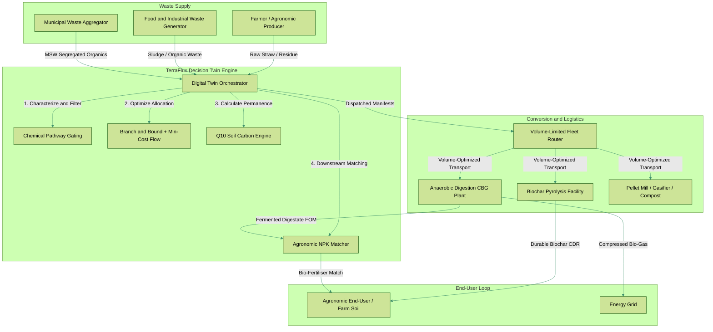

---

## 04 — Gallery — Key Screens


> All 9 key screen screenshots below are captured directly from the live deterministic engine running at `http://localhost:5173`.


<div align="center">

### Landing & Overview

| Landing Page | Network Overview |
|:---:|:---:|
| 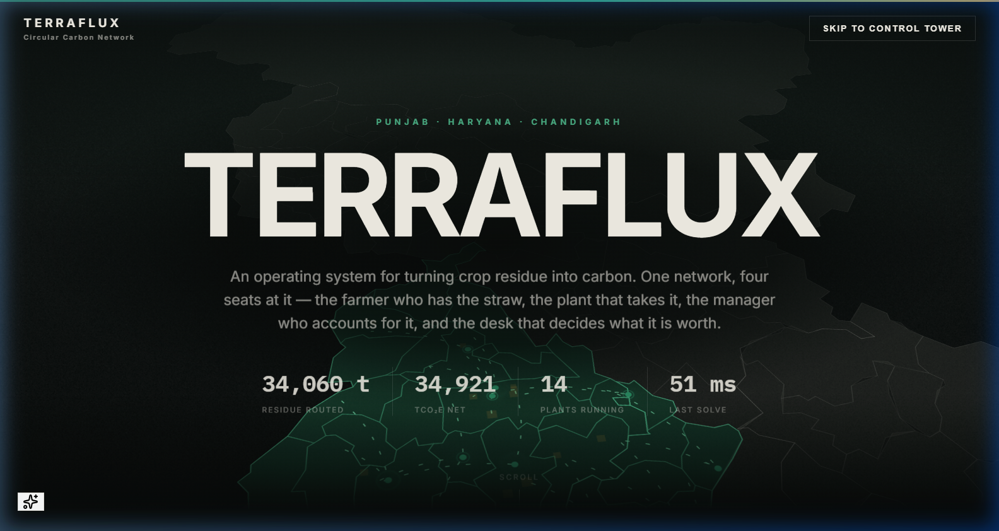 | 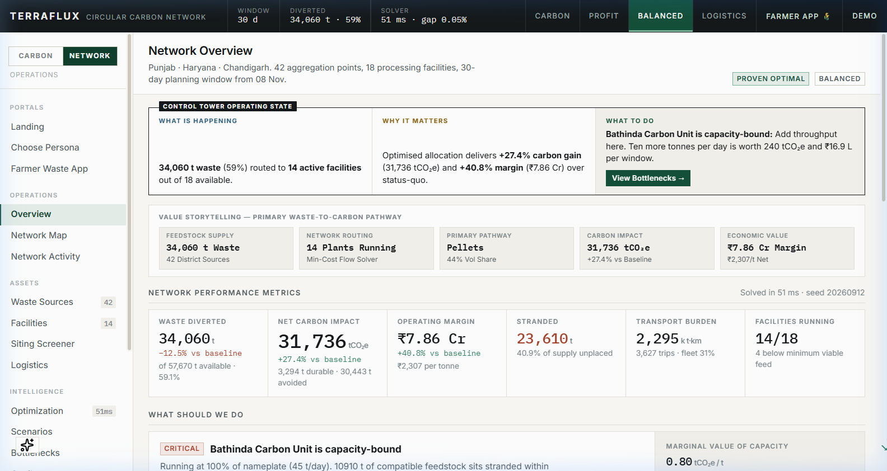 |
| `/ (Landing)` | `/overview` |

### Interactive Map & Optimization

| SVG Spatial Map | Optimization — Pareto Frontier |
|:---:|:---:|
| 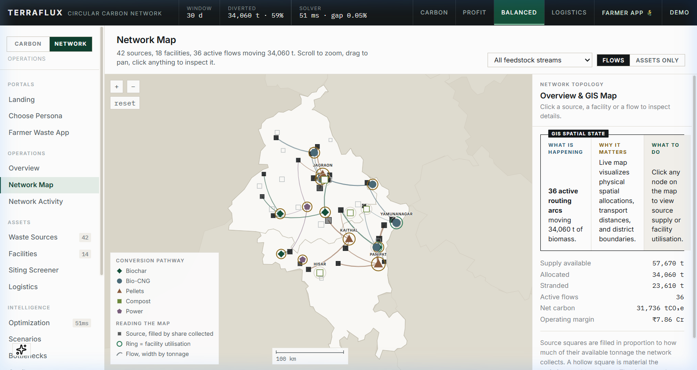 | 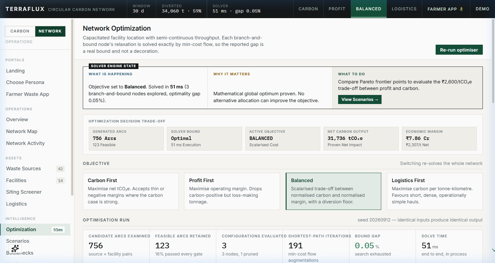 |
| `/map` | `/optimization` |

### Facilities & Facility Command

| Facilities — Fleet View | Facility Command — Drill-Down |
|:---:|:---:|
| 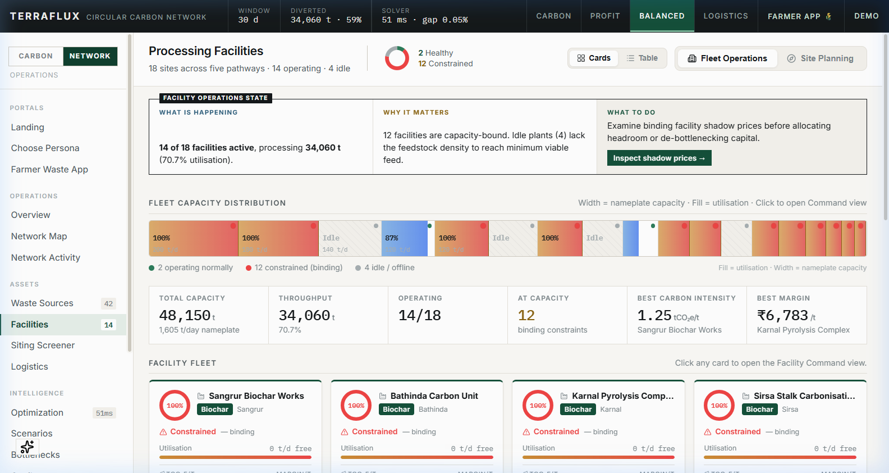 | 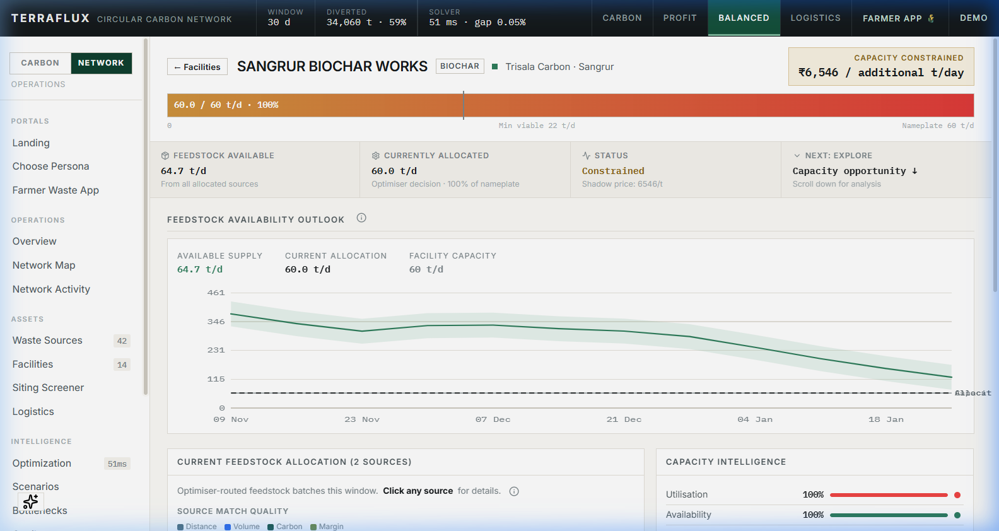 |
| `/facilities` | `/facility-command?id=<id>` |

### Carbon Hub & Bottlenecks

| Carbon Ledger | Bottlenecks — Stranding Analysis |
|:---:|:---:|
| 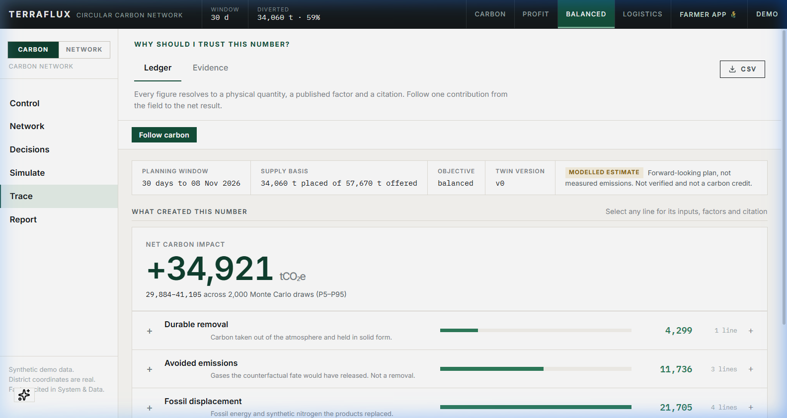 | 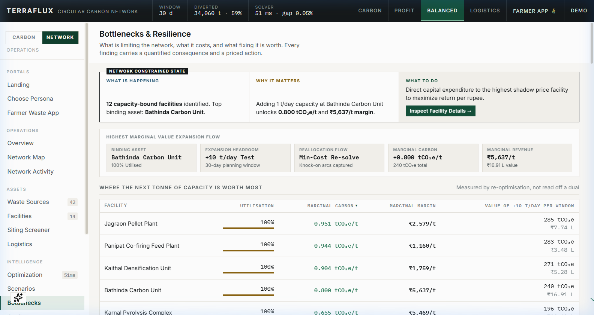 |
| `/carbon` → CarbonLedger | `/bottlenecks` |

### AI Copilot

| Gemini AI Copilot |
|:---:|
| 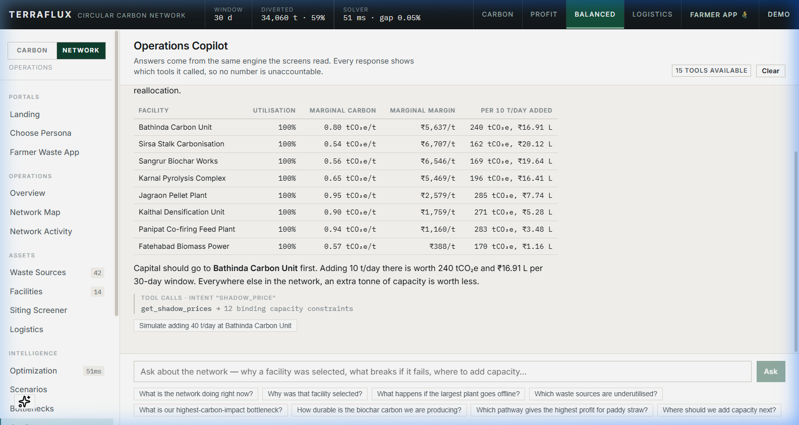 |
| `/copilot` (requires `GEMINI_API_KEY`) |

### Farmer / Waste Generator App

> A dedicated **mobile-first, farmer-first** app with multi-language support (English, Hindi, Punjabi, Marathi). Guides any waste generator from language selection to waste intake wizard to pathway recommendation and the Follow My Tonne material journey in under 60 seconds. Route: `/generator`

| Language Selector | Waste Category Intake |
|:---:|:---:|
|  | 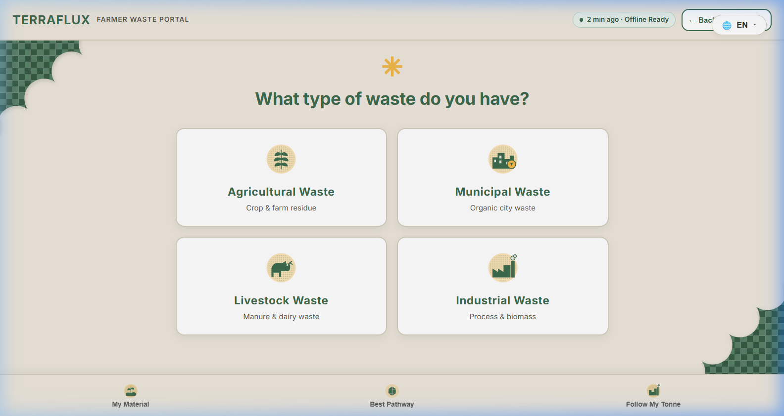 |
| `lang` tab - multi-language support | `intake_cat` tab - category picker |

| Pathway Recommendations | Follow My Tonne Material Journey |
|:---:|:---:|
| 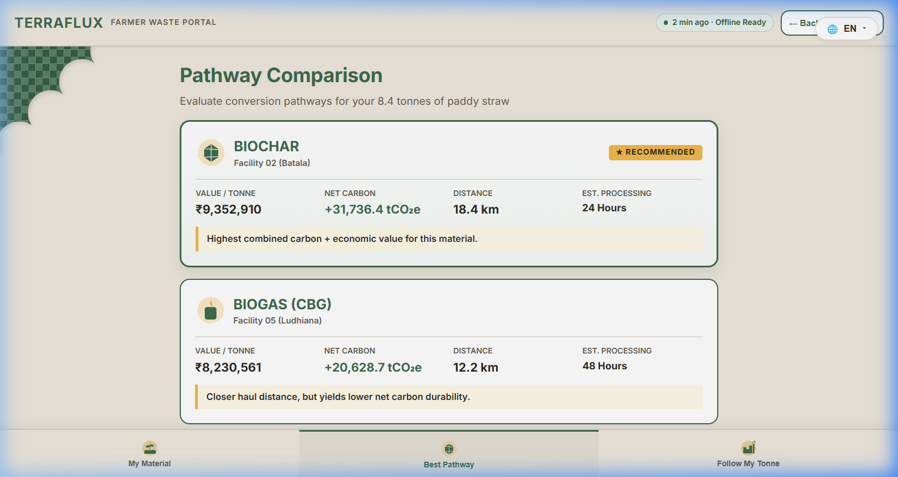 | 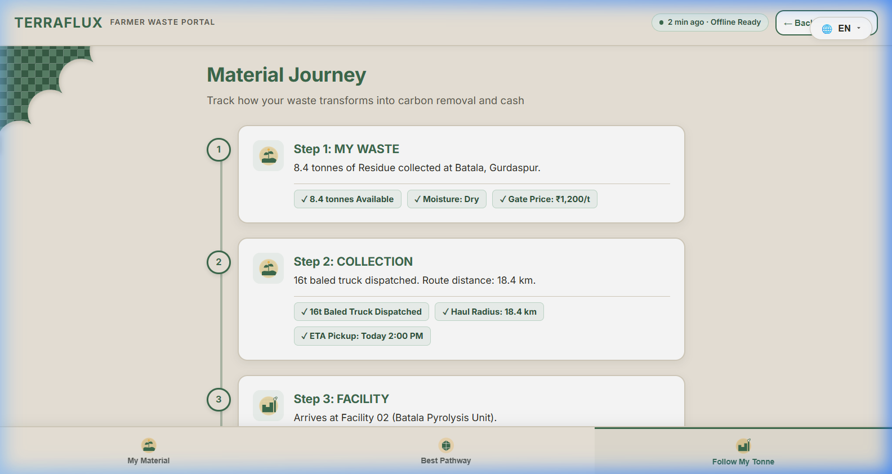 |
| `pathways` tab - ranked recommendations | `journey` tab - material traceability |

</div>

---

## 05 — Quick Start

> **Zero external dependencies. No Python. No Docker. No PostgreSQL. No Redis. No tile server. No credentials required.**

```bash
# Clone
git clone <repo-url>
cd APSV

# Install and run (one command)
npm install
npm run dev
```

| Service | URL | Description |
|---|---|---|
| Live deployed link | https://apsv-web.vercel.app/ | Full 27-screen React frontend |


### Optional: Gemini AI Copilot

```bash
# Create .env at project root
echo "GEMINI_API_KEY=your_key_here" > .env
```

The copilot calls the same 15 tools the UI does — every answer is numerically identical to what the dashboard screens show.

### Available Scripts

```bash
npm run dev          # Start both API + Web concurrently (recommended)
npm run dev:api      # API only (port 5174)
npm run dev:web      # Web only (port 5173)
npm run test         # Run engine + API test suite
npm run typecheck    # TypeScript strict check across monorepo
npm run build        # Production web bundle
```

---

## 05 — Monorepo Structure

```
APSV/
├── packages/
│   ├── engine/                    # Pure TypeScript deterministic twin engine (zero runtime deps)
│   │   └── src/
│   │       ├── types.ts           # Full domain model — all interfaces and enums
│   │       ├── streams.ts         # 9 feedstocks with full proximate/ultimate analysis
│   │       ├── pathways.ts        # 5 conversion pathways, hard gates + soft suitability
│   │       ├── network.ts         # 42 sources, 18 facilities (Punjab/Haryana/Chandigarh)
│   │       ├── optimizer.ts       # Branch-and-bound + min-cost flow, 4 objective modes
│   │       ├── mincostflow.ts     # Successive shortest paths, Johnson potentials
│   │       ├── carbon.ts          # Q10-corrected two-pool decay, Monte Carlo uncertainty
│   │       ├── economics.ts       # Per-tonne revenue/cost, DCF, LCOP, MACC, ABC, LCC
│   │       ├── routing.ts         # Volume-limited CVRP, Clarke-Wright + Or-opt
│   │       ├── forecast.ts        # Ridge regression, Fourier harmonics, walk-forward MAPE
│   │       ├── bottleneck.ts      # Stranding with attributed causes, N-1 resilience
│   │       ├── scenario.ts        # Clone-and-re-solve, flow diff attribution
│   │       ├── state.ts           # Twin: memoised derived artefacts, version counter
│   │       ├── copilot.ts         # 15 tools over the Twin, intent classification
│   │       ├── geo.ts             # Haversine, circuity, Web-Mercator projection
│   │       ├── rng.ts             # Seeded mulberry32, Box-Muller, lognormal draws
│   │       ├── constants.ts       # Every emission factor + price with source citation
│   │       ├── brief.ts           # Narrative generation from engine state
│   │       ├── evidence.ts        # Source citation registry
│   │       ├── facility.ts        # Facility profiles and capacity models
│   │       ├── opportunity.ts     # Unallocated tonne ranking by carbon value
│   │       ├── trace.ts           # Decision audit trail
│   │       ├── shock.ts           # Supply/demand shock simulation
│   │       ├── history.ts         # Optimisation run history
│   │       └── pathwaychoice.ts   # Pathway preference engine
│   │
│   ├── api/                       # Node.js native HTTP gateway (zero dependencies)
│   │   └── src/
│   │       └── index.ts           # Hand-rolled router, holds one Twin instance
│   │
│   └── web/                       # React + Vite frontend
│       └── src/
│           ├── pages/             # 27 screens (see Section 12)
│           ├── components/        # Shared UI components
│           ├── styles.css         # Full design system (~163 KB)
│           ├── store.tsx          # Global state, useTwin() hook
│           ├── router.tsx         # 60-line client-side router
│           └── i18n.ts            # Internationalisation strings
│
├── scripts/
│   └── dev.mjs                   # Concurrent API + Vite launcher (no concurrently package)
├── .env.example                  # Optional env vars (GEMINI_API_KEY, SMTP, DB)
├── tsconfig.json                 # Strict TypeScript, path aliases
├── package.json                  # Workspace root, Node >=22.6 requirement
├── README.md                     # This file
├── ARCHITECTURE.md               # Detailed system design rationale
├── ANALYSIS.md                   # Modelling decisions and reasoning
├── RESEARCH.md                   # Reference repository study, adopt/reject decisions
├── CHANGELOG.md                  # Build-order implementation milestones
└── CONTEXT.md                    # Complete project context document
```

---

## 06 — Engine Architecture

<div align="center">
<svg width="820" height="260" viewBox="0 0 820 260" xmlns="http://www.w3.org/2000/svg">
  <defs>
    <linearGradient id="archBg" x1="0%" y1="0%" x2="100%" y2="100%">
      <stop offset="0%" style="stop-color:#030d06"/>
      <stop offset="100%" style="stop-color:#040f1a"/>
    </linearGradient>
    <marker id="ag" markerWidth="6" markerHeight="6" refX="5" refY="3" orient="auto">
      <path d="M0,0 L0,6 L6,3 z" fill="#2d6a4f" fill-opacity="0.7"/>
    </marker>
    <marker id="ab" markerWidth="6" markerHeight="6" refX="5" refY="3" orient="auto">
      <path d="M0,0 L0,6 L6,3 z" fill="#1a4a2e" fill-opacity="0.7"/>
    </marker>
  </defs>
  <rect width="820" height="260" rx="10" fill="url(#archBg)" stroke="#2d6a4f" stroke-width="1" stroke-opacity="0.15"/>
  <!-- Layer 1: Web -->
  <rect x="10" y="8" width="800" height="50" rx="6" fill="#0a1a2e" stroke="#6366f1" stroke-width="1" stroke-opacity="0.5"/>
  <text x="20" y="24" font-family="monospace" font-size="9" fill="#818cf8" letter-spacing="1">WEB LAYER — React + Vite</text>
  <rect x="20" y="28" width="120" height="24" rx="4" fill="#0f2244" stroke="#6366f1" stroke-width="0.7"/>
  <text x="80" y="44" text-anchor="middle" font-family="monospace" font-size="8" fill="#a5b4fc">27 React Screens</text>
  <rect x="150" y="28" width="120" height="24" rx="4" fill="#0f2244" stroke="#6366f1" stroke-width="0.7"/>
  <text x="210" y="44" text-anchor="middle" font-family="monospace" font-size="8" fill="#a5b4fc">Custom SVG Charts</text>
  <rect x="280" y="28" width="120" height="24" rx="4" fill="#0f2244" stroke="#6366f1" stroke-width="0.7"/>
  <text x="340" y="44" text-anchor="middle" font-family="monospace" font-size="8" fill="#a5b4fc">Interactive SVG Map</text>
  <rect x="410" y="28" width="120" height="24" rx="4" fill="#0f2244" stroke="#6366f1" stroke-width="0.7"/>
  <text x="470" y="44" text-anchor="middle" font-family="monospace" font-size="8" fill="#a5b4fc">Gemini AI Copilot</text>
  <rect x="540" y="28" width="260" height="24" rx="4" fill="#0f2244" stroke="#6366f1" stroke-width="0.7"/>
  <text x="670" y="44" text-anchor="middle" font-family="monospace" font-size="8" fill="#a5b4fc">useTwin() hook — Single Source of Truth</text>
  <!-- Arrow down -->
  <path d="M410,58 L410,74" stroke="#6366f1" stroke-width="1.5" stroke-opacity="0.5" marker-end="url(#ab)"/>
  <text x="420" y="70" font-family="monospace" font-size="7" fill="#1a4a2e" fill-opacity="0.5">JSON over HTTP (Vite proxy in dev)</text>
  <!-- Layer 2: API -->
  <rect x="10" y="76" width="800" height="40" rx="6" fill="#0a1a10" stroke="#2d6a4f" stroke-width="1" stroke-opacity="0.5"/>
  <text x="20" y="92" font-family="monospace" font-size="9" fill="#40916c" letter-spacing="1">API GATEWAY — Node.js Native HTTP (zero deps) — One Twin instance — Cold start ~150 ms</text>
  <rect x="20" y="97" width="200" height="13" rx="3" fill="#0f1f14" stroke="#2d6a4f" stroke-width="0.5"/>
  <text x="120" y="107" text-anchor="middle" font-family="monospace" font-size="7" fill="#2d6a4f">--experimental-strip-types · no build step</text>
  <rect x="230" y="97" width="160" height="13" rx="3" fill="#0f1f14" stroke="#2d6a4f" stroke-width="0.5"/>
  <text x="310" y="107" text-anchor="middle" font-family="monospace" font-size="7" fill="#2d6a4f">15 tool endpoints</text>
  <!-- Arrow down -->
  <path d="M410,116 L410,130" stroke="#2d6a4f" stroke-width="1.5" stroke-opacity="0.5" marker-end="url(#ag)"/>
  <text x="420" y="127" font-family="monospace" font-size="7" fill="#2d6a4f" fill-opacity="0.5">direct function calls</text>
  <!-- Layer 3: Engine -->
  <rect x="10" y="132" width="800" height="120" rx="6" fill="#05140a" stroke="#40916c" stroke-width="1.5" stroke-opacity="0.6"/>
  <text x="20" y="148" font-family="monospace" font-size="9" fill="#1a4a2e" letter-spacing="1">ENGINE — Pure TypeScript · Zero Runtime Dependencies · One Implementation consumed as source by both sides</text>
  <!-- Twin box -->
  <rect x="20" y="155" width="110" height="90" rx="5" fill="#eef5f0" stroke="#40916c" stroke-width="1"/>
  <text x="75" y="170" text-anchor="middle" font-family="monospace" font-size="8" fill="#52b788">state.ts</text>
  <text x="75" y="182" text-anchor="middle" font-family="monospace" font-size="7" fill="#1a4a2e">Digital Twin</text>
  <text x="75" y="194" text-anchor="middle" font-family="monospace" font-size="7" fill="#40916c">Memoised artefacts</text>
  <text x="75" y="206" text-anchor="middle" font-family="monospace" font-size="7" fill="#40916c">Version counter</text>
  <text x="75" y="218" text-anchor="middle" font-family="monospace" font-size="7" fill="#40916c">In-process memory</text>
  <text x="75" y="230" text-anchor="middle" font-family="monospace" font-size="7" fill="#2d6a4f" fill-opacity="0.5">No DB needed</text>
  <rect x="20" y="155" width="110" height="90" rx="5" fill="none" stroke="#40916c">
    <animate attributeName="stroke-opacity" values="0.6;0.15;0.6" dur="3s" repeatCount="indefinite"/>
  </rect>
  <path d="M130,200 L145,200" stroke="#40916c" stroke-width="1" stroke-opacity="0.5" marker-end="url(#ag)"/>
  <!-- Engine modules grid -->
  <rect x="145" y="155" width="100" height="40" rx="4" fill="#eef5f0" stroke="#2d6a4f" stroke-width="0.8"/>
  <text x="195" y="173" text-anchor="middle" font-family="monospace" font-size="7" fill="#1a4a2e">optimizer.ts</text>
  <text x="195" y="185" text-anchor="middle" font-family="monospace" font-size="7" fill="#40916c">Branch-and-Bound</text>
  <rect x="145" y="200" width="100" height="40" rx="4" fill="#eef5f0" stroke="#2d6a4f" stroke-width="0.8"/>
  <text x="195" y="218" text-anchor="middle" font-family="monospace" font-size="7" fill="#1a4a2e">mincostflow.ts</text>
  <text x="195" y="230" text-anchor="middle" font-family="monospace" font-size="7" fill="#40916c">Johnson-Dijkstra</text>
  <rect x="255" y="155" width="100" height="40" rx="4" fill="#eef5f0" stroke="#2d6a4f" stroke-width="0.8"/>
  <text x="305" y="173" text-anchor="middle" font-family="monospace" font-size="7" fill="#1a4a2e">carbon.ts</text>
  <text x="305" y="185" text-anchor="middle" font-family="monospace" font-size="7" fill="#40916c">Q10 + 2000 MC draws</text>
  <rect x="255" y="200" width="100" height="40" rx="4" fill="#eef5f0" stroke="#2d6a4f" stroke-width="0.8"/>
  <text x="305" y="218" text-anchor="middle" font-family="monospace" font-size="7" fill="#1a4a2e">routing.ts</text>
  <text x="305" y="230" text-anchor="middle" font-family="monospace" font-size="7" fill="#40916c">Clarke-Wright+Or-opt</text>
  <rect x="365" y="155" width="100" height="40" rx="4" fill="#eef5f0" stroke="#2d6a4f" stroke-width="0.8"/>
  <text x="415" y="173" text-anchor="middle" font-family="monospace" font-size="7" fill="#1a4a2e">bottleneck.ts</text>
  <text x="415" y="185" text-anchor="middle" font-family="monospace" font-size="7" fill="#40916c">Stranding + N-1</text>
  <rect x="365" y="200" width="100" height="40" rx="4" fill="#eef5f0" stroke="#2d6a4f" stroke-width="0.8"/>
  <text x="415" y="218" text-anchor="middle" font-family="monospace" font-size="7" fill="#1a4a2e">scenario.ts</text>
  <text x="415" y="230" text-anchor="middle" font-family="monospace" font-size="7" fill="#40916c">Clone-mutate-resolve</text>
  <rect x="475" y="155" width="100" height="40" rx="4" fill="#eef5f0" stroke="#2d6a4f" stroke-width="0.8"/>
  <text x="525" y="173" text-anchor="middle" font-family="monospace" font-size="7" fill="#1a4a2e">economics.ts</text>
  <text x="525" y="185" text-anchor="middle" font-family="monospace" font-size="7" fill="#40916c">DCF/LCOP/MACC/LCC</text>
  <rect x="475" y="200" width="100" height="40" rx="4" fill="#eef5f0" stroke="#2d6a4f" stroke-width="0.8"/>
  <text x="525" y="218" text-anchor="middle" font-family="monospace" font-size="7" fill="#1a4a2e">forecast.ts</text>
  <text x="525" y="230" text-anchor="middle" font-family="monospace" font-size="7" fill="#40916c">Ridge+Fourier+12-fold</text>
  <rect x="585" y="155" width="100" height="40" rx="4" fill="#eef5f0" stroke="#2d6a4f" stroke-width="0.8"/>
  <text x="635" y="173" text-anchor="middle" font-family="monospace" font-size="7" fill="#1a4a2e">copilot.ts</text>
  <text x="635" y="185" text-anchor="middle" font-family="monospace" font-size="7" fill="#40916c">15 tools over Twin</text>
  <rect x="585" y="200" width="100" height="40" rx="4" fill="#eef5f0" stroke="#2d6a4f" stroke-width="0.8"/>
  <text x="635" y="218" text-anchor="middle" font-family="monospace" font-size="7" fill="#1a4a2e">geo.ts / rng.ts</text>
  <text x="635" y="230" text-anchor="middle" font-family="monospace" font-size="7" fill="#40916c">Haversine / mulberry32</text>
  <rect x="695" y="155" width="110" height="90" rx="4" fill="#eef5f0" stroke="#f59e0b" stroke-width="0.8"/>
  <text x="750" y="173" text-anchor="middle" font-family="monospace" font-size="7" fill="#fde68a">constants.ts</text>
  <text x="750" y="187" text-anchor="middle" font-family="monospace" font-size="7" fill="#b5813a">Every emission</text>
  <text x="750" y="199" text-anchor="middle" font-family="monospace" font-size="7" fill="#b5813a">factor + price</text>
  <text x="750" y="211" text-anchor="middle" font-family="monospace" font-size="7" fill="#b5813a">with source citation</text>
  <text x="750" y="227" text-anchor="middle" font-family="monospace" font-size="7" fill="#b5813a" fill-opacity="0.6">IPCC AR6 / Woolf 2021</text>
</svg>
</div>

### One Engine, Two Consumers

The engine is imported **as TypeScript source** by both the API (via Node's native `--experimental-strip-types` — no build step) and the web client (compiled by Vite). **One implementation, no compiled artefact between them that can go stale.** Editing a model file hot-reloads both processes.

### Digital Twin (`state.ts`)

`Twin` holds authoritative network state and memoises every derived artefact against a version counter. Changing the objective, an assumption, or committing a scenario bumps the version and invalidates the cache. **In-process memory** — no database, because the network seeds deterministically.

---

## 07 — Carbon Accounting

### Three Core Commitments

<div align="center">
<svg width="820" height="82" viewBox="0 0 820 82" xmlns="http://www.w3.org/2000/svg">
  <rect width="820" height="82" rx="8" fill="#030d06" stroke="#2d6a4f" stroke-width="0.5" stroke-opacity="0.3"/>
  <rect x="10" y="8" width="260" height="66" rx="6" fill="#eef5f0" stroke="#2d6a4f" stroke-width="1"/>
  <text x="140" y="28" text-anchor="middle" font-family="monospace" font-size="9" fill="#1a4a2e">1 BIOGENIC CO2 NOT COUNTED</text>
  <text x="140" y="44" text-anchor="middle" font-family="monospace" font-size="8" fill="#40916c">Only CH4 and N2O counted</text>
  <text x="140" y="57" text-anchor="middle" font-family="monospace" font-size="8" fill="#40916c">Avoided-burn = 0.082 tCO2e/dry t</text>
  <text x="140" y="70" text-anchor="middle" font-family="monospace" font-size="7" fill="#2d6a4f" fill-opacity="0.6">IPCC AR6 — not the ~1 t frequently claimed</text>
  <rect x="280" y="8" width="260" height="66" rx="6" fill="#eef5f0" stroke="#2d6a4f" stroke-width="1"/>
  <text x="410" y="28" text-anchor="middle" font-family="monospace" font-size="9" fill="#1a4a2e">2 REMOVAL != AVOIDANCE</text>
  <text x="410" y="44" text-anchor="middle" font-family="monospace" font-size="8" fill="#40916c">Separate ledger lines, priced separately</text>
  <text x="410" y="57" text-anchor="middle" font-family="monospace" font-size="8" fill="#40916c">CDR ~Rs.10,800/t vs avoid ~Rs.520/t</text>
  <text x="410" y="70" text-anchor="middle" font-family="monospace" font-size="7" fill="#2d6a4f" fill-opacity="0.6">~20x price gap — never summed</text>
  <rect x="550" y="8" width="260" height="66" rx="6" fill="#eef5f0" stroke="#2d6a4f" stroke-width="1"/>
  <text x="680" y="28" text-anchor="middle" font-family="monospace" font-size="9" fill="#1a4a2e">3 INDIA-CALIBRATED PERMANENCE</text>
  <text x="680" y="44" text-anchor="middle" font-family="monospace" font-size="8" fill="#40916c">Q10-corrected 14.9C to 26C soil</text>
  <text x="680" y="57" text-anchor="middle" font-family="monospace" font-size="8" fill="#40916c">Biochar decays 45% faster (fT=2.158)</text>
  <text x="680" y="70" text-anchor="middle" font-family="monospace" font-size="7" fill="#2d6a4f" fill-opacity="0.6">Woolf (2021) / Azzi et al. (2024)</text>
</svg>
</div>

### Q10 Soil-Temperature Corrected Biochar Permanence

Two-pool first-order exponential decay model:

$$C_{\text{rem}}(t) = (1 - f_{\text{pers}}) \cdot e^{-k_{\text{labile}} \cdot f_T \cdot t} + f_{\text{pers}} \cdot e^{-k_{\text{pers}} \cdot f_T \cdot t}$$

**Q10 Temperature Correction** (Woolf 2021 / Azzi et al. 2024 *Geoderma 441, 116761*):

$$f_T = Q_{10}^{\frac{T_{\text{soil}} - T_{\text{ref}}}{10}} = 2.0^{\frac{26.0 - 14.9}{10}} = 2.0^{1.11} \approx 2.158$$

> **Key Result**: Biochar carbon decays **~2.16× faster in Indian agricultural soils** than European default models assume.

| Feedstock | $BC_{100}$ @ 14.9 °C | $BC_{100}$ @ 26 °C | Delta |
|---|---:|---:|---:|
| Paddy straw | 82.0% | **77.1%** | −4.9 pp |
| Wheat straw | 80.5% | **75.7%** | −4.8 pp |
| Rice husk | 85.1% | **80.0%** | −5.1 pp |

### Monte Carlo Uncertainty

2,000 seeded **lognormal** draws over every emission factor and yield parameter → UI reports **P5 / P50 / P95**, never a fake-precision point estimate. Never normal draws — emission factors are strictly positive, normal draws can go silently negative.

### Avoided Emissions Formula (IPCC AR6)

$$E_{\text{avoided}} = \text{DM}_{\text{diverted}} \cdot \left[ (EF_{\text{CH4}} \cdot GWP_{\text{CH4}}) + (EF_{\text{N2O}} \cdot GWP_{\text{N2O}}) \right] \cdot C_{\text{factor}}$$

For paddy straw open-burning: **0.082 tCO₂e per dry tonne** (CH₄ 2.7 g/kg DM, N₂O 0.07 g/kg DM, combustion factor 0.89).

---

## 08 — Feedstock Modelling

Every feedstock carries **full proximate/ultimate analysis** — not a lookup table. Pathway yields are derived from first principles:

$$\text{Biochar Yield (Dry)} = 0.20 + 0.0055 \cdot Lignin\% + 0.0045 \cdot Ash\%$$

$$C_{\text{char}} = \frac{C_{\text{feed}} \cdot 0.50}{\text{Biochar Yield}}, \quad H/C_{\text{org}} = H:C_{\text{molar}} \cdot (0.19 - 0.0022 \cdot Lignin\%), \quad \text{Payload} = \min(M_{\text{rated}},\ V_{\text{deck}} \cdot \rho_{\text{bulk}})$$

### 9 Modelled Feedstocks

| Feedstock | Key Properties | Primary Pathway |
|---|---|---|
| Paddy straw | MC 14%, C:N 65, rho 0.15 t/m3 | Pyrolysis / Pellets |
| Wheat straw | MC 12%, C:N 80, rho 0.17 t/m3 | Pyrolysis / Pellets |
| Rice husk | MC 10%, Ash 20%, C:N 50 | Gasification |
| Dairy dung | MC 78%, C:N 18, BMP high | Anaerobic Digestion |
| Sugarcane bagasse | MC 50%, Lignin 22% | Pyrolysis / Composting |
| Cotton stalk | MC 13%, C:N 35, Lignin 28% | Pyrolysis |
| Food waste | MC 75%, C:N 22, BMP very high | Anaerobic Digestion |
| Municipal wet waste | MC 70%, C:N 20 | Anaerobic Digestion |
| Poultry litter | MC 55%, C:N 9 WARNING | **No viable pathway** |

### Hard Pathway Gates

| Gate | Pathway | Reason |
|---|---|---|
| Moisture <= 25% | Pyrolysis | Drying 70%-moisture feed costs more energy than char yields |
| Moisture >= 55% | Digestion | Below this, digester needs costly dilution water |
| C:N 15–40 | Digestion | <15 = ammonia inhibition; >40 = nitrogen-limited |
| Ash <= 20% | Pellets | High-silica straw slags boiler tubes |
| Ash <= 16% | Gasification | Ash and tar loading exceeds threshold |
| C:N 12–45 | Composting | Outside range, windrow won't establish |

---

## 09 — Optimiser

**Problem:** Capacitated facility-location with semi-continuous throughput — facilities run above minimum viable feed or not at all (binary), then continuous allocation across operating facilities.

### Method: Branch-and-Bound + Min-Cost Flow

```
root: every facility available
  └─ solve relaxation by min-cost flow → LP bound
     └─ any facility below minimum viable feed?
          no  → integer-feasible, candidate incumbent
          yes → branch on worst violator:
                  child A: facility does not run (forced off)
                  child B: facility must reach minimum feed (forced on)
```

Converges in **1–7 nodes** on this network. Best-first search, pruned against incumbent.

**Why not a metaheuristic?** Once the operating set is fixed, allocation is a transportation LP — linear, with an integral optimal solution guaranteed by the integrality theorem. Min-cost flow solves it **exactly**. A GA solves the same problem approximately, more slowly, with no optimality bound.

**Min-Cost Flow:** Successive shortest paths with Johnson potentials. SPFA seeds initial potentials; Dijkstra finds subsequent paths on non-negative reduced costs.

### 4 Objective Modes

| Mode | Objective | Use Case |
|---|---|---|
| Carbon First | max net tCO2e | Maximise emissions avoided + CDR |
| Profit First | max operating margin | Maximise Rs. per planning window |
| Balanced | 0.5 x normalised carbon + 0.5 x normalised margin | Default balanced operation |
| Logistics First | normalised carbon − 0.55 x tonne-km + 0.15 x margin | Minimise transport intensity |

### Shadow Prices

For each binding facility, TerraFlux adds 1 t/day headroom, re-solves the entire network, and records the objective delta. Deliberately **not LP dual read-off** — with binary decisions in play, duals describe current basis only. The Pareto frontier prices the carbon–profit trade-off at **~Rs. 2,600/tCO₂e**.

---

## 10 — Logistics Engine

> Baled paddy straw = 0.15 t/m³. A 16-tonne truck with 58 m³ deck carries only **8.7 t** — mass-only routing overstates fleet capacity by **>40%**.

$$\text{Payload} = \min\left(M_{\text{max}},\ V_{\text{deck}} \cdot \rho_{\text{bulk}}\right), \quad D_{\text{road}} = 1.28 \times D_{\text{Haversine}}, \quad N_{\text{trips}} = \left\lceil \frac{\text{Total Volume}}{\text{Payload}} \right\rceil$$

### CVRP-V Solver

- **Full truckloads** go direct (single pass)
- **Residual part-loads** consolidated by **Clarke-Wright savings** under both mass and volume constraints, improved with **Or-opt** local search
- All tours return to receiving facility
- **Vehicle selection emerges**: tractor-trolleys win short rural hauls, trucks win highway hauls — as a result of cost minimisation, not hard-coded rules

**Road distance:** Haversine × 1.28 circuity factor (India rural road correction). Live routing API not used — demo cannot depend on external service availability.

---

## 11 — Forecasting

Ridge regression on three Fourier seasonal harmonics + linear trend + two AR lags, solved in closed form via **Cholesky decomposition** of regularised normal equations:

$$\hat{\beta} = (X^T X + \lambda I)^{-1} X^T Y$$

- Trains in **< 1 ms per source** (42 sources total)
- Accuracy measured by **walk-forward backtest over 12 folds**, reported as MAPE
- Nothing asserts accuracy it hasn't earned

---

## 12 — Frontend — 27 Screens

All 27 screens read from the shared `Twin` via `useTwin()`. **No screen has its own data model.** Every chart is hand-written SVG — no charting library.

<div align="center">
<svg width="820" height="320" viewBox="0 0 820 320" xmlns="http://www.w3.org/2000/svg">
  <rect width="820" height="320" rx="10" fill="#030d06" stroke="#2d6a4f" stroke-width="0.5" stroke-opacity="0.2"/>
  <text x="410" y="18" text-anchor="middle" font-family="monospace" font-size="10" fill="#1a4a2e" letter-spacing="2">27 SCREENS — NAVIGATION MAP</text>
  <!-- Entry points -->
  <rect x="10" y="28" width="95" height="26" rx="4" fill="#eef5f0" stroke="#6366f1" stroke-width="1"/>
  <text x="57" y="45" text-anchor="middle" font-family="monospace" font-size="7" fill="#a5b4fc">Landing</text>
  <rect x="115" y="28" width="95" height="26" rx="4" fill="#eef5f0" stroke="#6366f1" stroke-width="1"/>
  <text x="162" y="45" text-anchor="middle" font-family="monospace" font-size="7" fill="#a5b4fc">TrueLanding</text>
  <rect x="220" y="28" width="95" height="26" rx="4" fill="#eef5f0" stroke="#6366f1" stroke-width="1"/>
  <text x="267" y="45" text-anchor="middle" font-family="monospace" font-size="7" fill="#a5b4fc">PersonaLanding</text>
  <!-- Row 1 main nav -->
  <rect x="10" y="64" width="80" height="26" rx="4" fill="#0a1a2e" stroke="#2d6a4f" stroke-width="0.8"/>
  <text x="50" y="81" text-anchor="middle" font-family="monospace" font-size="7" fill="#40916c">Overview</text>
  <rect x="98" y="64" width="80" height="26" rx="4" fill="#0a1a2e" stroke="#2d6a4f" stroke-width="0.8"/>
  <text x="138" y="81" text-anchor="middle" font-family="monospace" font-size="7" fill="#40916c">Map</text>
  <rect x="186" y="64" width="80" height="26" rx="4" fill="#0a1a2e" stroke="#2d6a4f" stroke-width="0.8"/>
  <text x="226" y="81" text-anchor="middle" font-family="monospace" font-size="7" fill="#40916c">Optimization</text>
  <rect x="274" y="64" width="80" height="26" rx="4" fill="#0a1a2e" stroke="#2d6a4f" stroke-width="0.8"/>
  <text x="314" y="81" text-anchor="middle" font-family="monospace" font-size="7" fill="#40916c">Scenarios</text>
  <rect x="362" y="64" width="80" height="26" rx="4" fill="#0a1a2e" stroke="#2d6a4f" stroke-width="0.8"/>
  <text x="402" y="81" text-anchor="middle" font-family="monospace" font-size="7" fill="#40916c">Bottlenecks</text>
  <rect x="450" y="64" width="80" height="26" rx="4" fill="#0a1a2e" stroke="#2d6a4f" stroke-width="0.8"/>
  <text x="490" y="81" text-anchor="middle" font-family="monospace" font-size="7" fill="#40916c">Facilities</text>
  <rect x="538" y="64" width="100" height="26" rx="4" fill="#0a1a2e" stroke="#2d6a4f" stroke-width="0.8"/>
  <text x="588" y="81" text-anchor="middle" font-family="monospace" font-size="7" fill="#40916c">FacilityCommand</text>
  <rect x="646" y="64" width="80" height="26" rx="4" fill="#0a1a2e" stroke="#2d6a4f" stroke-width="0.8"/>
  <text x="686" y="81" text-anchor="middle" font-family="monospace" font-size="7" fill="#40916c">Sources</text>
  <!-- Row 2 -->
  <rect x="10" y="98" width="80" height="26" rx="4" fill="#0a1a2e" stroke="#2d6a4f" stroke-width="0.8"/>
  <text x="50" y="115" text-anchor="middle" font-family="monospace" font-size="7" fill="#40916c">Logistics</text>
  <rect x="98" y="98" width="80" height="26" rx="4" fill="#0a1a2e" stroke="#2d6a4f" stroke-width="0.8"/>
  <text x="138" y="115" text-anchor="middle" font-family="monospace" font-size="7" fill="#40916c">Economics</text>
  <rect x="186" y="98" width="80" height="26" rx="4" fill="#0a1a2e" stroke="#2d6a4f" stroke-width="0.8"/>
  <text x="226" y="115" text-anchor="middle" font-family="monospace" font-size="7" fill="#40916c">Copilot</text>
  <rect x="274" y="98" width="80" height="26" rx="4" fill="#0a1a2e" stroke="#2d6a4f" stroke-width="0.8"/>
  <text x="314" y="115" text-anchor="middle" font-family="monospace" font-size="7" fill="#40916c">Activity</text>
  <rect x="362" y="98" width="80" height="26" rx="4" fill="#0a1a2e" stroke="#2d6a4f" stroke-width="0.8"/>
  <text x="402" y="115" text-anchor="middle" font-family="monospace" font-size="7" fill="#40916c">System</text>
  <rect x="450" y="98" width="100" height="26" rx="4" fill="#0a1a2e" stroke="#2d6a4f" stroke-width="0.8"/>
  <text x="500" y="115" text-anchor="middle" font-family="monospace" font-size="7" fill="#40916c">CarbonCommand</text>
  <rect x="558" y="98" width="100" height="26" rx="4" fill="#0a1a2e" stroke="#8b5cf6" stroke-width="0.8"/>
  <text x="608" y="115" text-anchor="middle" font-family="monospace" font-size="7" fill="#c4b5fd">GeneratorModule</text>
  <!-- Carbon Hub -->
  <rect x="10" y="134" width="800" height="148" rx="6" fill="#05100a" stroke="#40916c" stroke-width="1" stroke-opacity="0.5"/>
  <text x="410" y="152" text-anchor="middle" font-family="monospace" font-size="9" fill="#1a4a2e" letter-spacing="2">CARBON HUB — 7 DEDICATED SCREENS</text>
  <rect x="20" y="158" width="100" height="56" rx="4" fill="#eef5f0" stroke="#40916c" stroke-width="0.8"/>
  <text x="70" y="176" text-anchor="middle" font-family="monospace" font-size="7" fill="#1a4a2e">Carbon</text>
  <text x="70" y="189" text-anchor="middle" font-family="monospace" font-size="7" fill="#40916c">Hub overview</text>
  <text x="70" y="202" text-anchor="middle" font-family="monospace" font-size="7" fill="#2d6a4f" fill-opacity="0.5">Carbon.tsx</text>
  <rect x="130" y="158" width="100" height="56" rx="4" fill="#eef5f0" stroke="#40916c" stroke-width="0.8"/>
  <text x="180" y="176" text-anchor="middle" font-family="monospace" font-size="7" fill="#1a4a2e">CarbonLedger</text>
  <text x="180" y="189" text-anchor="middle" font-family="monospace" font-size="7" fill="#40916c">Per-arc traceable</text>
  <text x="180" y="202" text-anchor="middle" font-family="monospace" font-size="7" fill="#2d6a4f" fill-opacity="0.5">removal vs avoidance</text>
  <rect x="240" y="158" width="100" height="56" rx="4" fill="#eef5f0" stroke="#40916c" stroke-width="0.8"/>
  <text x="290" y="176" text-anchor="middle" font-family="monospace" font-size="7" fill="#1a4a2e">CarbonPathways</text>
  <text x="290" y="189" text-anchor="middle" font-family="monospace" font-size="7" fill="#40916c">Pathway carbon</text>
  <text x="290" y="202" text-anchor="middle" font-family="monospace" font-size="7" fill="#2d6a4f" fill-opacity="0.5">breakdown</text>
  <rect x="350" y="158" width="100" height="56" rx="4" fill="#eef5f0" stroke="#40916c" stroke-width="0.8"/>
  <text x="400" y="176" text-anchor="middle" font-family="monospace" font-size="7" fill="#1a4a2e">CarbonFacilities</text>
  <text x="400" y="189" text-anchor="middle" font-family="monospace" font-size="7" fill="#40916c">Facility carbon</text>
  <text x="400" y="202" text-anchor="middle" font-family="monospace" font-size="7" fill="#2d6a4f" fill-opacity="0.5">linked FacilityCmd</text>
  <rect x="460" y="158" width="100" height="56" rx="4" fill="#eef5f0" stroke="#40916c" stroke-width="0.8"/>
  <text x="510" y="176" text-anchor="middle" font-family="monospace" font-size="7" fill="#1a4a2e">CarbonEvidence</text>
  <text x="510" y="189" text-anchor="middle" font-family="monospace" font-size="7" fill="#40916c">Source citations</text>
  <text x="510" y="202" text-anchor="middle" font-family="monospace" font-size="7" fill="#2d6a4f" fill-opacity="0.5">P5/P50/P95 bands</text>
  <rect x="570" y="158" width="100" height="56" rx="4" fill="#eef5f0" stroke="#40916c" stroke-width="0.8"/>
  <text x="620" y="176" text-anchor="middle" font-family="monospace" font-size="7" fill="#1a4a2e">CarbonReport</text>
  <text x="620" y="189" text-anchor="middle" font-family="monospace" font-size="7" fill="#40916c">Printable summary</text>
  <text x="620" y="202" text-anchor="middle" font-family="monospace" font-size="7" fill="#2d6a4f" fill-opacity="0.5">carbon accounting</text>
  <rect x="680" y="158" width="120" height="56" rx="4" fill="#eef5f0" stroke="#40916c" stroke-width="0.8"/>
  <text x="740" y="176" text-anchor="middle" font-family="monospace" font-size="7" fill="#1a4a2e">CarbonOpportunities</text>
  <text x="740" y="189" text-anchor="middle" font-family="monospace" font-size="7" fill="#40916c">Highest-value</text>
  <text x="740" y="202" text-anchor="middle" font-family="monospace" font-size="7" fill="#2d6a4f" fill-opacity="0.5">unallocated tonnes</text>
  <rect x="20" y="222" width="110" height="54" rx="4" fill="#eef5f0" stroke="#40916c" stroke-width="0.8"/>
  <text x="75" y="240" text-anchor="middle" font-family="monospace" font-size="7" fill="#1a4a2e">CarbonScenarios</text>
  <text x="75" y="253" text-anchor="middle" font-family="monospace" font-size="7" fill="#40916c">Carbon what-if</text>
  <text x="75" y="266" text-anchor="middle" font-family="monospace" font-size="7" fill="#2d6a4f" fill-opacity="0.5">scenarios</text>
  <!-- SVG charts label -->
  <rect x="10" y="292" width="800" height="22" rx="4" fill="#05100a" stroke="#f59e0b" stroke-width="0.8" stroke-opacity="0.4"/>
  <text x="410" y="307" text-anchor="middle" font-family="monospace" font-size="7" fill="#fde68a">CUSTOM HAND-WRITTEN SVG CHARTS (no library): FleetBar · CapacityGauge · AllocationFlow · FeedstockOutlookChart · WhatIfBars · SourceScoreBar · CapacityHeatmap · Pareto Frontier · Monte Carlo Bands · MACC Curve</text>
</svg>
</div>

### Key Screen Details

**`/map`** — Interactive SVG spatial map with real district geometry for Punjab, Haryana, Chandigarh (131 KB, Douglas-Peucker simplified, embedded in bundle). Flow arcs animate between sources and facilities, coloured by pathway. No tile server — cannot fail in front of an audience.

**`/facilities`** — Fleet Health Ring (SVG donut: Healthy/Constrained/Idle), FleetBar, Pathway×District utilisation heatmap, card/table toggle. Embedded Municipal Siting Screener.

**`/facility-command?id=<id>`** — Per-facility operational control: Capacity Gauge (SVG arc), Allocation Flow ranked bar, 12-week supply forecast, What-If sliders with debounced re-optimisation (live twin untouched), shadow prices.

**`/optimization`** — Objective mode switcher, Pareto frontier chart, solver stats (nodes explored, bound gap), shadow price table.

**Loading states name the computation**: *"Running 2,000 Monte Carlo draws over every emission factor"* — not a spinner.

---

## 13 — Key Numbers

<div align="center">
<svg width="820" height="110" viewBox="0 0 820 110" xmlns="http://www.w3.org/2000/svg">
  <rect width="820" height="110" rx="8" fill="#030d06" stroke="#2d6a4f" stroke-width="0.5" stroke-opacity="0.3"/>
  <rect x="10" y="10" width="150" height="90" rx="6" fill="#eef5f0" stroke="#2d6a4f" stroke-width="1"/>
  <text x="85" y="44" text-anchor="middle" font-family="monospace" font-size="28" font-weight="900" fill="#2d6a4f">42</text>
  <text x="85" y="60" text-anchor="middle" font-family="monospace" font-size="9" fill="#1a4a2e">Waste Sources</text>
  <text x="85" y="74" text-anchor="middle" font-family="monospace" font-size="7" fill="#40916c" fill-opacity="0.6">Punjab+Haryana+Chandigarh</text>
  <rect x="170" y="10" width="150" height="90" rx="6" fill="#eef5f0" stroke="#2d6a4f" stroke-width="1"/>
  <text x="245" y="44" text-anchor="middle" font-family="monospace" font-size="28" font-weight="900" fill="#2d6a4f">18</text>
  <text x="245" y="60" text-anchor="middle" font-family="monospace" font-size="9" fill="#1a4a2e">Facilities</text>
  <text x="245" y="74" text-anchor="middle" font-family="monospace" font-size="7" fill="#40916c" fill-opacity="0.6">CBG/Pyrolysis/Pellets/Gasif/Compost</text>
  <rect x="330" y="10" width="150" height="90" rx="6" fill="#eef5f0" stroke="#2d6a4f" stroke-width="1"/>
  <text x="405" y="44" text-anchor="middle" font-family="monospace" font-size="28" font-weight="900" fill="#2d6a4f">9</text>
  <text x="405" y="60" text-anchor="middle" font-family="monospace" font-size="9" fill="#1a4a2e">Feedstock Types</text>
  <text x="405" y="74" text-anchor="middle" font-family="monospace" font-size="7" fill="#40916c" fill-opacity="0.6">Full proximate/ultimate analysis</text>
  <rect x="490" y="10" width="150" height="90" rx="6" fill="#eef5f0" stroke="#2d6a4f" stroke-width="1"/>
  <text x="565" y="40" text-anchor="middle" font-family="monospace" font-size="20" font-weight="900" fill="#2d6a4f">57,700t</text>
  <text x="565" y="57" text-anchor="middle" font-family="monospace" font-size="9" fill="#1a4a2e">Total Supply Modelled</text>
  <text x="565" y="71" text-anchor="middle" font-family="monospace" font-size="7" fill="#40916c" fill-opacity="0.6">48,150t nameplate capacity</text>
  <text x="565" y="84" text-anchor="middle" font-family="monospace" font-size="7" fill="#b5813a" fill-opacity="0.7">41% structurally stranded</text>
  <rect x="650" y="10" width="160" height="90" rx="6" fill="#eef5f0" stroke="#2d6a4f" stroke-width="1"/>
  <text x="730" y="44" text-anchor="middle" font-family="monospace" font-size="28" font-weight="900" fill="#2d6a4f">27</text>
  <text x="730" y="60" text-anchor="middle" font-family="monospace" font-size="9" fill="#1a4a2e">Frontend Screens</text>
  <text x="730" y="74" text-anchor="middle" font-family="monospace" font-size="7" fill="#40916c" fill-opacity="0.6">All custom SVG charts</text>
</svg>
</div>

### Central Trade-off: Carbon vs. Profit

| Pathway | Net Carbon (per tonne straw) | Margin | Why |
|---|---:|---:|---|
| Pyrolysis to Biochar | ~0.69 tCO2e | ~Rs. 6,100 | Locks ~40% feedstock C; earns CDR at Rs. 10,800/t |
| Pellets to Co-firing | ~1.15 tCO2e | ~Rs. 2,500 | Displaces coal 1:1 on energy; only avoidance at Rs. 520/t |

Co-firing wins on **carbon**. Pyrolysis wins on **money**. Switching objective mode visibly re-routes the entire network. The Pareto frontier prices the trade-off at **~Rs. 2,600/tCO₂e**.

---

## 14 — Performance Benchmarks

All timings measured on Node v22, cold start inclusive:

<div align="center">
<svg width="820" height="170" viewBox="0 0 820 170" xmlns="http://www.w3.org/2000/svg">
  <rect width="820" height="170" rx="8" fill="#030d06" stroke="#2d6a4f" stroke-width="0.5" stroke-opacity="0.3"/>
  <text x="410" y="18" text-anchor="middle" font-family="monospace" font-size="10" fill="#1a4a2e" letter-spacing="2">PERFORMANCE BENCHMARKS</text>
  <text x="10" y="42" font-family="monospace" font-size="8" fill="#40916c">Full Network Optimisation</text>
  <text x="10" y="66" font-family="monospace" font-size="8" fill="#40916c">Shadow Prices (12-18 re-solves)</text>
  <text x="10" y="90" font-family="monospace" font-size="8" fill="#40916c">Monte Carlo 2,000 draws</text>
  <text x="10" y="114" font-family="monospace" font-size="8" fill="#40916c">Forecast 42 sources + backtests</text>
  <text x="10" y="138" font-family="monospace" font-size="8" fill="#40916c">Scenario: baseline + mutate + diff</text>
  <text x="10" y="162" font-family="monospace" font-size="8" fill="#40916c">N-1 Resilience / Cold API Start</text>
  <rect x="290" y="28" width="470" height="16" rx="3" fill="#eef5f0"/>
  <rect x="290" y="52" width="470" height="16" rx="3" fill="#eef5f0"/>
  <rect x="290" y="76" width="470" height="16" rx="3" fill="#eef5f0"/>
  <rect x="290" y="100" width="470" height="16" rx="3" fill="#eef5f0"/>
  <rect x="290" y="124" width="470" height="16" rx="3" fill="#eef5f0"/>
  <rect x="290" y="148" width="470" height="16" rx="3" fill="#eef5f0"/>
  <!-- 25-180ms full bar -->
  <rect x="290" y="28" width="470" height="16" rx="3" fill="#2d6a4f" fill-opacity="0.65">
    <animate attributeName="width" from="0" to="470" dur="1.2s" fill="freeze"/>
  </rect>
  <text x="768" y="40" font-family="monospace" font-size="8" fill="#1a4a2e">25-180 ms</text>
  <!-- 50ms -->
  <rect x="290" y="52" width="130" height="16" rx="3" fill="#2d6a4f" fill-opacity="0.55">
    <animate attributeName="width" from="0" to="130" dur="1s" fill="freeze"/>
  </rect>
  <text x="768" y="64" font-family="monospace" font-size="8" fill="#1a4a2e">~50 ms</text>
  <!-- 25ms -->
  <rect x="290" y="76" width="65" height="16" rx="3" fill="#40916c" fill-opacity="0.65">
    <animate attributeName="width" from="0" to="65" dur="0.8s" fill="freeze"/>
  </rect>
  <text x="768" y="88" font-family="monospace" font-size="8" fill="#1a4a2e">~25 ms</text>
  <!-- 45ms -->
  <rect x="290" y="100" width="117" height="16" rx="3" fill="#2d6a4f" fill-opacity="0.55">
    <animate attributeName="width" from="0" to="117" dur="1s" fill="freeze"/>
  </rect>
  <text x="768" y="112" font-family="monospace" font-size="8" fill="#1a4a2e">~45 ms</text>
  <!-- 150ms -->
  <rect x="290" y="124" width="391" height="16" rx="3" fill="#2d6a4f" fill-opacity="0.45">
    <animate attributeName="width" from="0" to="391" dur="1.1s" fill="freeze"/>
  </rect>
  <text x="768" y="136" font-family="monospace" font-size="8" fill="#1a4a2e">~150 ms</text>
  <!-- 60+150ms -->
  <rect x="290" y="148" width="391" height="16" rx="3" fill="#1a4a2e" fill-opacity="0.35">
    <animate attributeName="width" from="0" to="391" dur="1.1s" fill="freeze"/>
  </rect>
  <text x="768" y="160" font-family="monospace" font-size="8" fill="#1a4a2e">~60 / ~150 ms</text>
</svg>
</div>

---

## 15 — Notable Model Findings

> [!IMPORTANT]
> These are **real outputs of the deterministic engine**, not crafted narratives.

1. **Poultry litter has no viable pathway** — C:N of 9 falls below the stable window for digestion and composting; moisture rules out every thermal route. The bottleneck engine names this explicitly and recommends co-digestion with press mud (1:2.5 ratio lifts C:N above 15).

2. **Optimiser diverts less tonnage than proximity heuristic — and this is correct.** Sending every lot to the closest willing facility includes loss-making tonnes. Dropping them yields **+27% net carbon and +41% margin on 17% less transport**.

3. **41% of supply is structurally stranded** — not a modelling failure. Crop residue can only go to pellets/pyrolysis/gasification (~22,950 t capacity) but represents ~37,000 t of supply. Shadow price of the most constrained plant: **0.80 tCO₂e and Rs. 5,637 per additional tonne of throughput per day**.

4. **Composting cattle dung is carbon-negative** — windrow composting emits more CH₄ and N₂O than the open heap it replaces avoids. Model strands dung once digestion capacity is full. Finding: **digest dung, do not compost it**.

---

## 16 — Design Decisions and Rejections

| Chosen | Rejected | Reason |
|---|---|---|
| Min-cost flow + Branch-and-Bound | Genetic algorithm, PSO, ACO | Inner problem is a transportation LP — exact beats approximate, gives bound + duals |
| Shadow prices by re-optimisation | LP duals from single basis | Binary facility decisions make single-basis duals misleading |
| Ridge regression (Cholesky) | XGBoost / LightGBM | No dependency-free JS equivalent; inspectable coefficients > marginal MAPE gain |
| Clarke-Wright + Or-opt | OR-Tools CVRP | No Python runtime; residual part-load problem is small after full loads removed |
| Lognormal Monte Carlo | Normal draws | Emission factors strictly positive; normal draws can go negative silently |
| Integer objective scaling | Float comparison | Float tie-breaks cause non-reproducible optimal answers |
| Haversine x circuity factor | Live routing API | Demo cannot depend on external service availability |
| In-process seeded state | PostgreSQL + Redis | Nothing to persist; restart = same deterministic baseline |
| Embedded SVG map (131 KB) | Tile server / Leaflet | Tile server cannot fail in front of an audience |
| --experimental-strip-types | tsc compile step for API | Single source, no stale compiled artefact between engine and API |

---

## 17 — Scientific References

All demo data is **synthetic and seeded**. Every emission factor and price is drawn from peer-reviewed or regulatory sources, cited at point of use in `constants.ts`:

| Reference | Used For |
|---|---|
| IPCC 2006/2019 Guidelines | CH4, N2O emission factors for open burning and landfill |
| Woolf (2021) ES&T | Q10 biochar permanence relation, two-pool model parameterisation |
| Azzi et al. (2024) Geoderma 441 116761 | Harmonised two-pool decay model calibration |
| CEA CO2 Baseline Database | Indian grid emission factor for displacement credits |
| MNRE / SATAT Tariffs | CBG purchase price, off-take obligations |
| European Biochar Certificate (EBC) | H/C(org) permanence thresholds for CDR classification |
| IPCC AR6 GWP values | CH4 GWP100 = 28 (fossil), N2O GWP100 = 273 |

### Reference Repository Study

Six repositories studied; no source code copied. Scientific formulae cited at point of use.

| Repo | Licence | Key Insight Adopted |
|---|---|---|
| puro-earth/PuroBiocharPersistenceEdition2025 | CC BY-SA 4.0 | Q10 two-pool decay, re-calibrated to Indian soil temperature |
| aws-samples/wastecollector-planner | MIT-0 | Volume-limited CVRP (not just mass) |
| RishvinReddy/EcoBin-Smart-Waste-Management-System | NOASSERTION | Forecast-then-optimise architecture; stranding-with-reason |
| akshaya-borugadda/intelligent-waste-management | None | Mandatory baseline comparison on every result |
| SwolfPy-Project/swolfpy | GPL-2.0 | Seeded Monte Carlo uncertainty; removal != avoidance |
| pimct/MIRA_project | MIT | Multi-objective mode switching; feedstock-specific yields; Pareto frontier |

---

## 18 — Production Roadmap

| # | Change | Current Demo | Production |
|---|---|---|---|
| 1 | Road Routing | Haversine x 1.28 circuity | OSRM over OSM extract |
| 2 | Supply Telemetry | Seeded synthetic data | Real IoT / weighbridge feeds |
| 3 | Persistence | In-process memory | PostgreSQL for scenarios and plan versions |
| 4 | Char Analysis | H/C(org) modelled from proximate | Measured H/C(org) on actual biochar for verified credits |
| 5 | Process Models | Property-derived yield equations | ANN surrogates over thermodynamic simulations |
| 6 | Temporal Coupling | Spot allocation per window | Contracted feedstock with temporal windows |

---

<div align="center">

<svg width="820" height="55" viewBox="0 0 820 55" xmlns="http://www.w3.org/2000/svg">
  <defs>
    <linearGradient id="footerBg" x1="0%" y1="0%" x2="100%" y2="100%">
      <stop offset="0%" style="stop-color:#030d06"/>
      <stop offset="100%" style="stop-color:#040f1a"/>
    </linearGradient>
    <linearGradient id="footerText" x1="0%" y1="0%" x2="100%" y2="0%">
      <stop offset="0%" style="stop-color:#2d6a4f"/>
      <stop offset="50%" style="stop-color:#40916c"/>
      <stop offset="100%" style="stop-color:#1a4a2e"/>
    </linearGradient>
    <filter id="footerGlow">
      <feGaussianBlur stdDeviation="2" result="coloredBlur"/>
      <feMerge><feMergeNode in="coloredBlur"/><feMergeNode in="SourceGraphic"/></feMerge>
    </filter>
  </defs>
  <rect width="820" height="55" rx="8" fill="url(#footerBg)" stroke="#2d6a4f" stroke-width="1" stroke-opacity="0.2"/>
  <text x="410" y="24" text-anchor="middle" font-family="monospace" font-size="14" fill="url(#footerText)" letter-spacing="4" filter="url(#footerGlow)">TERRAFLUX</text>
  <text x="410" y="42" text-anchor="middle" font-family="monospace" font-size="9" fill="#40916c" fill-opacity="0.7" letter-spacing="2">Built for High-Impact Circular Carbon Logistics · HackOut 26 · PS11</text>
  <circle cx="60" cy="28" r="3" fill="#2d6a4f" fill-opacity="0.5">
    <animate attributeName="fill-opacity" values="0.5;0.1;0.5" dur="2s" repeatCount="indefinite"/>
  </circle>
  <circle cx="760" cy="28" r="3" fill="#2d6a4f" fill-opacity="0.5">
    <animate attributeName="fill-opacity" values="0.1;0.5;0.1" dur="2s" repeatCount="indefinite"/>
  </circle>
</svg>

<br/>

**Team: Last Commit** | Track: Waste-to-Carbon Value Chain Tracker | HackOut '26 PS11

</div>
