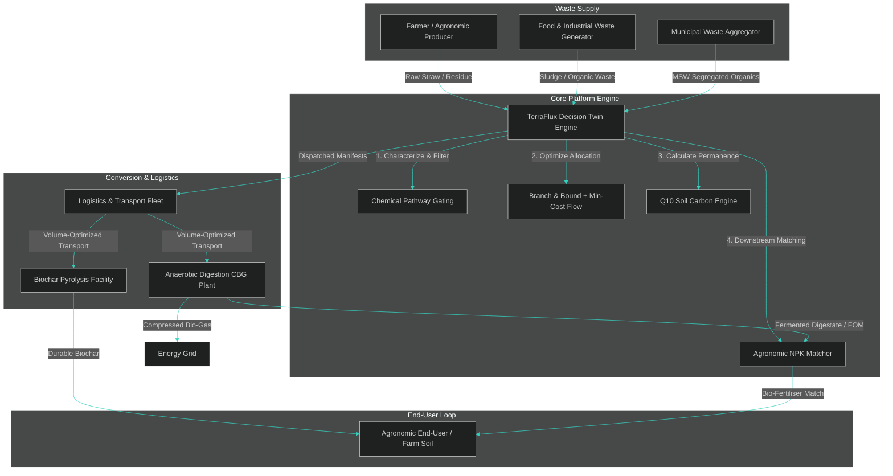
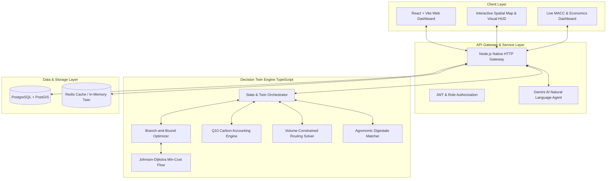
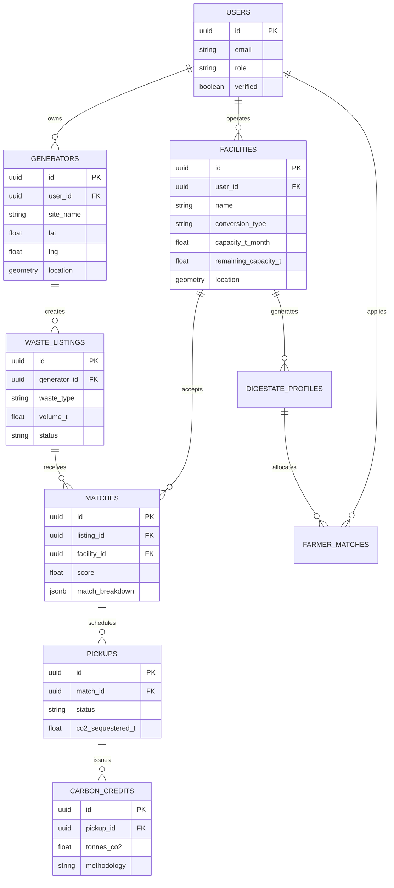

<div align="center">
  <h1>TERRAFLUX</h1>
  <h3>Waste-to-Carbon Intelligence & Circular Value Chain Platform</h3>
  <p><em>"WASTE IS NOT THE END OF A JOURNEY. IT IS THE BEGINNING OF A CARBON VALUE CHAIN."</em></p>
  <p><strong>Team: Last Commit</strong> | <strong>Track: Waste-to-Carbon Value Chain Tracker</strong></p>

```
  ┌─────────────────┐      ┌────────────────────────┐      ┌────────────────────┐      ┌────────────────────────┐      ┌──────────────────────┐
  │  WASTE STREAM   │ ───► │ WASTE CHARACTERIZATION │ ───► │ OPTIMAL CONVERSION │ ───► │ DURABLE CARBON REMOVAL │ ───► │ DOWNSTREAM VALUE LOG │
  │ (Agro/Ind/Muni) │      │  (Proximate/Ultimate)  │      │ (Biochar / Biogas) │      │ (Q10 Soil Permanence)  │      │ (Farmer Digestate)   │
  └─────────────────┘      └────────────────────────┘      └────────────────────┘      └────────────────────────┘      └──────────────────────┘
```
</div>

---

## 01 — HERO

Organic waste rotting in municipal landfills and agricultural stubble burning in open fields represent two of the largest unmitigated sources of atmospheric methane ($\text{CH}_4$) and nitrous oxide ($\text{N}_2\text{O}$). While thermochemical (pyrolysis) and biochemical (anaerobic digestion) pathways exist to transform these wastes into high-value biochar and compressed bio-gas (CBG), the underlying supply chain is fundamentally fragmented.

**TerraFlux** is an enterprise-grade, deterministic **Waste-to-Carbon Intelligence Platform**. Rather than acting as a static marketplace or a simple lookup index, TerraFlux implements a **capacitated multi-objective optimization engine** that evaluates the entire physical, chemical, logistical, and agronomic lifecycle of organic biomass—from gate to grid, and from digester to farm soil.

```
       WASTE  ───►  CHARACTERIZE  ───►  EVALUATE  ───►  OPTIMIZE  ───►  CONVERT  ───►  MEASURE  ───►  CLOSE THE LOOP
  (Residue/Food)   (Moisture/Ash/CN)   (Pathway Gates)  (Min-Cost Flow) (Biochar/CBG)  (Q10 Decays)   (Farmer Digestate)
```

---

## 02 — THE PROBLEM

### The Scale of Atmospheric Inefficiency
According to the UN Environment Programme (UNEP) Food Waste Index and IPCC guidelines:
* Organic waste decomposing in anaerobic landfill conditions generates **8–10% of global greenhouse gas emissions**.
* Methane ($\text{CH}_4$) released during open decay possesses a Global Warming Potential ($GWP_{100}$) **27–30 times** that of $\text{CO}_2$, and over **80 times** higher over a 20-year horizon ($GWP_{20}$).
* In agricultural corridors like the Punjab–Haryana belt, over **20 million tonnes of paddy straw** are burned within a narrow 20-day harvest window due to logistical friction, releasing toxic particulate matter ($\text{PM}_{2.5}$) and severe carbon spikes.

```
┌─────────────────────────────────────────────────────────────────────────────────────────────────────────┐
│                                       CURRENT FRAGMENTED WORKFLOW                                       │
└─────────────────────────────────────────────────────────────────────────────────────────────────────────┘

  [ FARMER / INDUSTRY ]               [ WASTE TRUCK ]                   [ LANDFILL / OPEN FIELD ]
   Produces Paddy Straw/   ───►  Indiscriminate Mass Haul  ───►  Open Burning / Anaerobic Rot
   Food Sludge                   (Volume-Blind Payload)         (Methane & N2O Plumes Released)

                                         VS.

  [ BIOGAS / BIOCHAR PLANT ] ───► Operates at 40% Capacity  ───► High Idle Fixed Costs
   (Expensive Infrastructure)      (Feedstock Unchecked)          (Disjointed Downstream Products)
```

### Why Existing Approaches Fail
Most current software solutions attempt to build a simple "Tinder for Waste"—a marketplace matching sellers to nearby buyers. This approach fails fundamentally because:
1. **Chemical Incompatibility**: High-moisture waste ($>70\%$) destroys pyrolysis energy balances; low C:N ratios ($<15$) induce ammonia toxicity in anaerobic digesters.
2. **Volumetric Logistics Bottlenecks**: Baled paddy straw has a bulk density of $\sim 0.15\text{ t/m}^3$. A standard 16-tonne truck hits its deck volume ceiling at just **8.7 tonnes**. Mass-only routing overestimates transport capacity by over $40\%$.
3. **Decay Permanence Miscalculations**: Biochar permanence is parameterised by its $H/C_{\text{org}}$ molar ratio and target soil temperature. Standard European accounting models ($14.9^\circ\text{C}$) overestimate carbon stability when applied to warm tropical soils ($26^\circ\text{C}$).
4. **Open-Loop Waste Chains**: Existing tools terminate tracking at the conversion facility, ignoring the hundreds of tonnes of residual **digestate / fermented organic manure (FOM)** produced daily, which must be returned to agricultural soils.

---

## 03 — THE INSIGHT

> ### *"THE NEAREST FACILITY IS NOT NECESSARILY THE BEST DESTINATION."*

Distance alone is a dangerously incomplete metric for waste allocation. A biochar facility located $5\text{ km}$ away may reject a waste stream due to $65\%$ moisture content, while an anaerobic digestion plant $35\text{ km}$ away can convert that exact stream into vehicle-grade CBG and nitrogen-rich digestate with a net positive economic margin and higher carbon abatement.

### The Decision Model

For every candidate pathway $p$ connecting waste stream $i$ to facility $j$, TerraFlux evaluates a multi-objective scalar utility function:

$$\text{Score}_{ijp} = w_{\text{val}} \cdot \text{NetValue}_{ijp} + w_{\text{carb}} \cdot \text{NetCarbon}_{ijp} - w_{\text{log}} \cdot \text{LogisticsCost}_{ij} - w_{\text{proc}} \cdot \text{ProcessingCost}_{j} - w_{\text{risk}} \cdot \text{RiskFactor}_{j}$$

Where:
* $\text{NetValue}_{ijp}$: Gross market revenue from primary bio-products (biochar, CBG, electricity) and co-products (digestate).
* $\text{NetCarbon}_{ijp}$: Sum of durable carbon sequestered ($C_{\text{perm}}$) plus avoided landfill/burning emissions ($E_{\text{avoid}}$) minus transport and conversion emissions ($E_{\text{trans}} + E_{\text{proc}}$).
* $\text{LogisticsCost}_{ij}$: Transport cost accounting for vehicle payload limits and road network circuity ($1.28 \times \text{Haversine}$).
* $\text{RiskFactor}_{j}$: Operational penalty based on facility capacity utilization, downtime history, and feed gate compatibility.

---

## 04 — TERRAFLUX PLATFORM

TerraFlux is a unified, multi-tenant platform designed to optimize organic waste value chains end-to-end.

```
                                  ┌────────────────────────────────────────┐
                                  │            TERRAFLUX ENGINE            │
                                  └───────────────────┬────────────────────┘
                                                      │
         ┌──────────────────────┬─────────────────────┼─────────────────────┬──────────────────────┐
         ▼                      ▼                     ▼                     ▼                      ▼
  ┌──────────────┐      ┌──────────────┐      ┌──────────────┐      ┌──────────────┐      ┌──────────────┐
  │ CHARACTERIZE │      │   EVALUATE   │      │   OPTIMIZE   │      │   CONVERT    │      │  CLOSE LOOP  │
  │ Feedstock C, │ ───► │ Hard Gate &  │ ───► │ Min-Cost &   │ ───► │ Thermochem & │ ───► │ Agronomic    │
  │ Ash, N, H2O, │      │ Suitability  │      │ Branch-Bound │      │ Biochemical  │      │ Farmer NPK   │
  │ Bulk Density │      │ Filtering    │      │ Multi-Obj    │      │ Processing   │      │ Matching     │
  └──────────────┘      └──────────────┘      └──────────────┘      └──────────────┘      └──────────────┘
```

---

## 05 — STAKEHOLDER ECOSYSTEM

TerraFlux synchronizes four primary operational roles in a closed-loop carbon network:



---

## 06 — END-TO-END WORKFLOW

```mermaid
%%{init: {'theme': 'dark', 'themeVariables': { 'primaryColor': '#059669', 'lineColor': '#10b981'}}}%%
flowchart LR
    A[1. Waste Listing Created] --> B[2. Proximate/Ultimate Analysis]
    B --> C[3. Pathway Gate Filtering]
    C --> D[4. Volume-Constrained CVRP]
    D --> E[5. Min-Cost Flow Allocation]
    E --> F[6. Conversion & Product Yield]
    F --> G[7. Q10 Carbon Permanence Ledger]
    G --> H[8. Downstream Digestate Matching]
    H --> I[9. Farmer Soil Application & Settlement]
```



---

## 07 — SYSTEM ARCHITECTURE

TerraFlux is built as a zero-dependency monorepo that executes natively on standard Node environments.



---

## 08 — DATA FLOW

Every tonne of biomass follows a 10-phase deterministic lifecycle:

```
  [ 1. INPUT ] ──► [ 2. VALIDATE ] ──► [ 3. NORMALIZE ] ──► [ 4. EXTRACT FEATURES ] ──► [ 5. MATCH PATHWAY ]
  GPS & Volume      Schema Check        Dry Matter Basis     C, N, Ash, Moisture, Lignin   Gate Hard-Filtering

  [ 6. OPTIMIZE ] ◄── [ 7. SCORE ] ◄── [ 8. EXPLAIN ] ◄── [ 9. ACTION DISPATCH ] ◄── [ 10. RECORD IMPACT ]
  Min-Cost Flow       Multi-Objective   Copilot Rationale    Truck Routing & Gate Pass   MACC Ledger & Credits
```

---

## 09 — WASTE CHARACTERIZATION

Rather than relying on static lookup tables, TerraFlux models waste streams by their fundamental thermochemical properties:

### Feedstock Analytical Schema

| Property | Symbol | Unit | Description | Impact on Conversion |
|---|---|---|---|---|
| **Moisture Content** | $MC$ | $\%$ | Water fraction in wet feedstock | Moisture $>25\%$ invalidates pyrolysis; moisture $<55\%$ requires dilution water in AD |
| **Ash Content** | $Ash$ | $\%$ (dry) | Inorganic mineral silica/alkali fraction | High ash reduces biochar carbon purity ($C_{\text{char}}$) and slags boiler pellets |
| **Carbon Content** | $C_{\text{feed}}$ | $\%$ (dry) | Elemental organic carbon | Primary driver of yield and carbon permanence |
| **Hydrogen Content** | $H_{\text{feed}}$ | $\%$ (dry) | Elemental hydrogen | Determines $H/C_{\text{org}}$ molar stability ratio |
| **Lignin Content** | $Lignin$ | $\%$ (dry) | Recalcitrant structural polymer | High lignin boosts biochar yield ($Y_{\text{char}}$) and char stability |
| **Carbon-to-Nitrogen** | $C:N$ | ratio | Molar ratio of organic C to N | Optimum AD range $15–40$; $<15$ causes ammonia inhibition |
| **Bulk Density** | $\rho_{\text{bulk}}$ | $\text{t/m}^3$ | Mass per volumetric unit | Determines truck volume limits ($\text{Payload} = \min(M_{\text{rated}}, V_{\text{deck}} \cdot \rho_{\text{bulk}})$) |
| **Biochemical Methane Potential** | $BMP$ | $\text{m}^3\text{ CH}_4/\text{t VS}$ | Anaerobic digestion yield parameter | Direct driver of biogas cubic metre production per volatile solid tonne |

### Derived Chemical Relations

$$\text{Biochar Yield (Dry)} = 0.20 + 0.0055 \cdot Lignin\% + 0.0045 \cdot Ash\%$$

$$\text{Char Carbon Content } (C_{\text{char}}) = \frac{C_{\text{feed}} \cdot 0.50}{\text{Biochar Yield}}$$

$$\text{Char } H/C_{\text{org}} = H:C_{\text{molar}} \cdot (0.19 - 0.0022 \cdot Lignin\%)$$

$$\text{Achievable Truck Payload} = \min\left(M_{\text{max}}, V_{\text{deck}} \cdot \rho_{\text{bulk}}\right)$$

### Hard Suitability Gates

```
  Feedstock Stream ──► [ Moisture Gate ≤ 25% ] ──► Pyrolysis Viable
                   ──► [ Moisture Gate ≥ 55% ] ──► Digestion Viable
                   ──► [ C:N Ratio 15 – 40   ] ──► Stable Methane Fermentation
                   ──► [ Ash Gate ≤ 16%      ] ──► Pelleting / Gasification Viable
```

---

## 10 — FACILITY MATCHING ENGINE

Candidate facilities are generated via PostGIS spatial filtering and ranked using a multi-criteria scoring algorithm.

### Transparent Scoring Matrix Example

| Facility ID | Facility Type | Distance (km) | Distance Score | Capacity Score | Pathway Fit | Economic Score | Carbon Score | Risk Score | **Final Score** |
|---|---|---|---|---|---|---|---|---|---|
| **FAC-PB-01** (Ludhiana CBG) | Anaerobic Digestion | $18.4$ | $92$ | $96$ | $98$ | $88$ | $94$ | $91$ | **93.2** |
| **FAC-PB-04** (Jalandhar Pyrolysis) | Biochar Pyrolysis | $42.1$ | $74$ | $85$ | $62$ (High $H_2O$) | $71$ | $89$ | $85$ | **75.4** |
| **FAC-PB-08** (Patiala Pellets) | Pellet Plant | $68.0$ | $51$ | $40$ | $35$ (High Ash) | $45$ | $60$ | $70$ | **48.8** |

---

## 11 — ROUTE OPTIMIZATION

Logistics optimization solves a **Capacitated Vehicle Routing Problem with Volume Constraints (CVRP-V)**.

```
       [ GENERATOR SITE ]
     (120 tonnes Baled Straw)
                │
                │ Volume-Bound Haul (8.7 t per 16t Truck)
                ▼
      ┌───────────────────┐
      │  COLLECTION POINT │
      └─────────┬─────────┘
                │
        Road Network (Circuity Factor = 1.28)
                │
                ├──► Route A (18.4 km) ──► Facility 1 (Active, High Margin)
                └──► Route B (42.1 km) ──► Facility 2 (Offline, Contingency)
```

### Routing Formulations
* **Road Distance**: $D_{\text{road}} = 1.28 \times D_{\text{Haversine}}$
* **Trip Count**: $N_{\text{trips}} = \left\lceil \frac{\text{Total Volume}}{\text{Achievable Payload}} \right\rceil$
* **Transport Emissions**: $E_{\text{trans}} = N_{\text{trips}} \cdot D_{\text{road}} \cdot E_{\text{vehicle, km}}$

---

## 12 — CARBON ENGINE

### Biogenic CO₂ Exclusion & Avoided Emissions
Residue carbon returning to the atmosphere via natural aerobic decomposition is considered biogenic carbon-neutral. TerraFlux strictly counts avoided **non-$\text{CO}_2$ warming gases** ($\text{CH}_4$ and $\text{N}_2\text{O}$) based on IPCC AR6 GWP values:

$$E_{\text{avoided}} = \text{DM}_{\text{diverted}} \cdot \left[ (EF_{\text{CH4, burn}} \cdot GWP_{\text{CH4}}) + (EF_{\text{N2O, burn}} \cdot GWP_{\text{N2O}}) \right] \cdot C_{\text{factor}}$$

For agricultural paddy straw, avoided open-burning credit equals **$0.082 \text{ tCO}_2\text{e}$ per dry tonne**.

### Q10 Soil-Temperature Corrected Biochar Permanence

Biochar carbon persistence ($BC_{100}$) is evaluated using a two-pool first-order exponential decay model:

$$C_{\text{rem}}(t) = (1 - f_{\text{pers}}) \cdot e^{-k_{\text{labile}} \cdot f_T \cdot t} + f_{\text{pers}} \cdot e^{-k_{\text{pers}} \cdot f_T \cdot t}$$

Where:
* $f_{\text{pers}} = 1 - \frac{H/C_{\text{org}}}{0.7}$ (Persistent carbon pool fraction)
* $k_{\text{labile}} = 0.035\text{ yr}^{-1}, \quad k_{\text{pers}} = 0.0003\text{ yr}^{-1}$
* **Woolf (2021) / Azzi et al. (2024) Q10 Soil Temperature Correction**:

$$f_T = Q_{10}^{\frac{T_{\text{soil}} - T_{\text{ref}}}{10}}$$

Applying an Indian mean annual soil temperature $T_{\text{soil}} = 26.0^\circ\text{C}$ against the European reference baseline $T_{\text{ref}} = 14.9^\circ\text{C}$ with $Q_{10} = 2.0$:

$$f_T = 2.0^{\frac{26.0 - 14.9}{10}} = 2.0^{1.11} \approx 2.158$$

> **Key Result**: Biochar carbon decays **$2.16\times$ faster in Indian agricultural soils** than European default models assume. TerraFlux accurately reflects this empirical reality in its MACC accounting.

---

## 13 — TWO-WAY MATCHING ENGINE

### Closing the Downstream Loop: Biogas Facility $\rightarrow$ Digestate $\rightarrow$ Farmer

Anaerobic digestion produces large quantities of liquid and solid **Fermented Organic Manure (FOM) / Digestate**. Indiscriminate dumping of digestate creates localized nutrient runoff and methane slip. TerraFlux closes the loop by matching digestate production to candidate farmland:

```
  ┌─────────────────────────────────┐
  │     BIO-GAS PLANT (CBG)         │ ───► Produces 45 tonnes/day Digestate (FOM)
  └────────────────┬────────────────┘
                   │
                   ▼
  ┌─────────────────────────────────┐
  │ DOWNSTREAM MATCHING ENGINE      │
  │  - Soil NPK Deficit Analysis    │
  │  - Crop Salt Tolerance Check    │
  │  - Application Timing Window    │
  │  - Transport Radius & Cost      │
  └────────────────┬────────────────┘
                   │
                   ├──► Match Score: 96.4% ──► Farm Site Alpha (Wheat, High N Deficit, 6.2 km)
                   └──► Match Score: 81.2% ──► Farm Site Beta (Mustard, Moderate N Deficit, 14.5 km)
```

### Agronomic Decision Support Guardrails
> [!NOTE]
> Downstream digestate recommendations serve as **agronomic decision support**. All matched applications recommend localized soil testing and consultation with Krishi Vigyan Kendra (KVK) / Certified Agronomists before bulk soil application.

---

## 14 — WHAT-IF SIMULATOR

TerraFlux features a real-time network perturbation simulator to test supply chain resilience under extreme events:

```
┌─────────────────────────────────────────────────────────────────────────────────────────────────────────┐
│                                   REAL-TIME SIMULATION COMPARISON                                       │
└─────────────────────────────────────────────────────────────────────────────────────────────────────────┘

   METRIC                     BASELINE SCENARIO             FACILITY OUTAGE (-40% CAP)     VARIANCE
  ───────────────────────────────────────────────────────────────────────────────────────────────────
   Allocated Volume           4,500 t/day                   3,820 t/day                    -15.1%
   Stranded Biomass           120 t/day                     800 t/day                      +566.7%
   Avg Logistics Cost         ₹420 / tonne                  ₹585 / tonne                   +39.3%
   Net Carbon Abatement       384 tCO2e/day                 312 tCO2e/day                  -18.75%
   Shadow Price Surge         ₹0 / tonne headroom           ₹1,850 / tonne headroom        +₹1,850
```

---

## 15 — CITY-SCALE MODE

City-Scale Mode aggregates hundreds of municipal wet-waste collection points, industrial food processing facilities, and regional farms across an entire district network (e.g. Punjab–Haryana corridor: Ludhiana, Patiala, Sangrur, Karnal).

```
   [ LUDHIANA MSW WET WASTE ] ──────┐
   [ SANGRUR PADDY STRAW ]    ──────┼──► [ TERRAFLUX CENTRAL ENGINE ] ──► Multi-Facility Allocation
   [ PATIALA DAIRY SLUDGE ]   ──────┘                                     & Network MACC Optimization
```

---

## 16 — EXPLAINABLE AI

TerraFlux combines deterministic engine state with Gemini AI Copilot logic to generate natural-language rationale for every optimization decision:

```
  USER QUERY: "Why was Facility B chosen over Facility A for Listing #892?"

  AI COPILOT RESPONSE:
  "Facility B (Ludhiana CBG) was selected over Facility A (Patiala Pyrolysis) because:
   1. Feedstock Moisture Content (68%) violated Facility A's maximum thermal gate (≤ 25%).
   2. Facility B has 2.1× available capacity headroom (450 tonnes remaining vs 80 tonnes).
   3. Even though Facility B is 11.2 km further, its net carbon abatement is 0.14 tCO2e/t higher
      due to biogenic methane capture displacing fossil CNG."
```

---

## 17 — DETAILED TECHNICAL ARCHITECTURE

### Monorepo Structure

```
carbonloop/
├── packages/
│   ├── web/           # React + Vite Frontend (Custom SVG Mapping & HUD)
│   ├── api/           # Node.js Zero-Dependency HTTP API Gateway
│   ├── engine/        # Pure TypeScript Deterministic Twin Engine
│   └── backend/       # PostgreSQL + PostGIS Knex Services
├── docs/              # Technical Specifications & System Diagrams
└── package.json       # Workspace Root Configuration
```

---

## 18 — DATABASE SCHEMA



---

## 19 — API DESIGN

### Core RESTful Specifications

#### `POST /api/waste-streams`
Creates a new characterized waste stream manifest.
```json
// Request Payload
{
  "generator_id": "gen-pb-8812",
  "waste_type": "agricultural_biomass",
  "volume_t": 150.0,
  "properties": {
    "moisture_pct": 14.5,
    "ash_pct": 11.2,
    "carbon_pct": 42.8,
    "hydrogen_pct": 5.1,
    "lignin_pct": 18.4,
    "cn_ratio": 32.0,
    "bulk_density_t_m3": 0.15
  },
  "location": { "lat": 30.9010, "lng": 75.8573 }
}
```

#### `POST /api/match/facility`
Triggers multi-criteria facility evaluation for a manifest.
```json
// Response Payload
{
  "listing_id": "list-9918",
  "matches": [
    {
      "facility_id": "fac-cbg-01",
      "facility_name": "Ludhiana Bio-CNG Facility",
      "score": 93.2,
      "breakdown": {
        "distance_km": 18.4,
        "capacity_headroom_t": 850.0,
        "pathway_fit": 0.98,
        "net_carbon_tco2e": 12.3,
        "economic_margin_inr": 18500.0
      }
    }
  ]
}
```

---

## 20 — ALGORITHMIC SPECIFICATIONS

### 1. Geospatial Haversine & Circuity Distance Model
$$\Delta \sigma = 2 \arcsin \sqrt{\sin^2\left(\frac{\Delta \phi}{2}\right) + \cos \phi_1 \cos \phi_2 \sin^2\left(\frac{\Delta \lambda}{2}\right)}$$
$$D_{\text{road}} = 1.28 \cdot R_{\text{earth}} \cdot \Delta \sigma$$

### 2. Multi-Property Yield & Gate Filtering Algorithm
```typescript
function evaluatePathwayGates(feed: FeedstockProps, pathway: Pathway): GateResult {
  if (feed.moisturePct > pathway.maxMoisture) {
    return { viable: false, reason: `Moisture ${feed.moisturePct}% exceeds maximum gate ${pathway.maxMoisture}%` };
  }
  if (feed.cnRatio < pathway.minCN || feed.cnRatio > pathway.maxCN) {
    return { viable: false, reason: `C:N ratio ${feed.cnRatio} outside viable window [${pathway.minCN}, ${pathway.maxCN}]` };
  }
  return { viable: true, reason: 'Passed all thermochemical gates' };
}
```

### 3. Min-Cost Flow Transportation Solver
Solves linear continuous allocation over candidate network arcs using Successive Shortest Path with Johnson Potentials (SPFA + Dijkstra).

### 4. Branch-and-Bound Semi-Continuous Solver
Solves binary facility on/off decisions subject to minimum operational throughput constraints ($\text{Throughput}_j \ge \text{MinViableFeed}_j \text{ OR } 0$).

### 5. Q10 Soil-Temperature Corrected Carbon Permanence
$$f_T = 2.0^{\frac{T_{\text{soil}} - 14.9}{10}}, \quad BC_{100} = (1 - f_{\text{pers}}) e^{-k_{\text{labile}} f_T \cdot 100} + f_{\text{pers}} e^{-k_{\text{pers}} f_T \cdot 100}$$

### 6. Agronomic Downstream Digestate Matcher
Matches digestate volume to crop NPK deficit, soil pH, and transport radius.

### 7. Perturbation Shadow Pricing Solver
Re-solves the network with $+1\text{ t/day}$ headroom on binding facility constraints to compute shadow prices ($\lambda_j = \frac{\Delta \text{Objective}}{\Delta \text{Capacity}}$).

### 8. Closed-Form Ridge Regression Supply Forecaster
Fits Fourier seasonal harmonics and lag features using Cholesky decomposition:

$$\hat{\beta} = (X^T X + \lambda I)^{-1} X^T Y$$

---

<div align="center">
  <p><strong>TerraFlux — Built for High-Impact Circular Carbon Logistics</strong></p>
</div>
